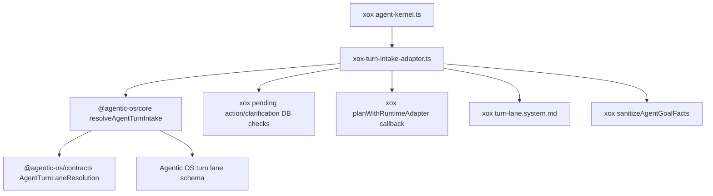

# M111 删除宿主 Turn Intake Resolver

Status: implemented and verified
Date: 2026-06-20

## 目标

M111 继续按“删除宿主 agent 框架”推进。本轮删除 xox 本地 `turn-intake-resolver.ts`，把 turn intake 协议迁入 Agentic OS。

turn intake 不是 xox 业务逻辑。它决定当前用户消息进入轻量 direct answer，还是进入完整 agent loop；当存在 pending action、pending clarification、provider 不可用或模型没返回稳定 lane contract 时，它必须 fail closed 到完整 agent goal lane。这是 SaaS harness CPU 边界。

## 模块分工

Agentic OS：

- `@agentic-os/contracts`
  - 新增 `AgentTurnLane`、`AgentTurnLaneReasonCode`、`AgentTurnLaneResolution`。
- `@agentic-os/core`
  - 新增 `resolveAgentTurnIntake()`；
  - 新增 `AGENT_TURN_LANE_RESOLUTION_TOOL_NAME`；
  - 新增 `AGENT_TURN_LANE_RESOLUTION_TOOL_SCHEMA`；
  - 新增 `normalizeAgentTurnLaneResolution()` 和 `forcedAgentTurnLaneResolution()`。

xox：

- `apps/api/src/agent/agent-kernel.ts`
  - 调用 xox thin adapter；
- `apps/api/src/agent/agentic-os/xox-turn-intake-adapter.ts`
  - 调用 Agentic OS turn intake；
  - 提供 pending action / pending clarification DB callback；
  - 提供 runtime model callback；
  - 保留 xox-specific `turn-lane.system.md` 和 `sanitizeAgentGoalFacts()`。
- `apps/api/src/agent/turn-intake-resolver.ts`
  - 删除。

## 依赖图



## 验证

```bash
cd C:\Github\agentic-os
npm.cmd run build -w @agentic-os/contracts
npm.cmd run build -w @agentic-os/core
npm.cmd run test -w @agentic-os/core
npm.cmd run check

cd C:\Github\xox-model
npm.cmd run build:api
npm.cmd run test --workspace @xox/api -- tests/agent-architecture.test.ts
npm.cmd run test:api
```

预期：

- Agentic OS core turn intake 测试通过；
- xox build 证明没有旧 resolver import；
- architecture guard 证明 `turn-intake-resolver.ts` 不存在；
- direct answer 和 agent goal API 行为保持。

已验证（2026-06-20）：

- `npm.cmd run build -w @agentic-os/contracts` 通过；
- `npm.cmd run build -w @agentic-os/core` 通过；
- `npm.cmd run test -w @agentic-os/core` 通过：151 tests；
- `npm.cmd run check` 在 `C:\Github\agentic-os` 通过；
- `npm.cmd run build:api` 在 `C:\Github\xox-model` 通过；
- `npm.cmd run test --workspace @xox/api -- tests/agent-architecture.test.ts` 通过：33 tests；
- `npm.cmd run test:api` 通过：14 files，237 tests。

## 完成标准

- `turn-intake-resolver.ts` 删除；
- `agent-kernel.ts` 使用 `resolveAgentTurnIntake()`；
- xox 不再硬编码 `turn_lane_resolve` schema / lane enum；
- xox 行为与删除前一致或更好。
