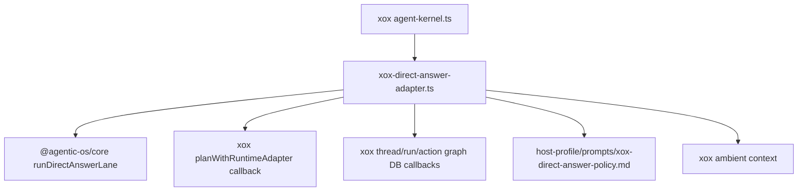

# M112 删除宿主 Direct Answer Runtime

Status: implemented and verified
Date: 2026-06-20

## 目标

M112 继续按“删除宿主 agent 框架”推进。本轮删除 xox 本地 `direct-answer-runtime.ts`，把 direct answer lane 的通用状态机迁入 Agentic OS。

direct answer 不是 xox 业务逻辑，也不是第二套轻量 agent。它是 turn intake 之后的一条 harness lane：无工具、单次 provider call、只接受 assistant text；如果 provider 失败、返回 tool call、返回空内容，必须 fail closed 成宿主可持久化的失败结果，不能用本地语义兜底。

## 参考不变量

- OpenAI Agents JS runner 把 tool call 视为 loop continuation，把 assistant text 视为 terminal output；direct answer lane 不能把 tool call 当成最终回答。
- OpenClaw 的 harness runtime 边界强调显式 fail closed，不应在 runtime 不可用时掉到 unrelated fallback。
- Hermes Agent 把 no-agent/deliver-only 路径和正常 agent loop 分开；M112 采用同样边界：direct answer 是受限无工具 lane，不是 xox 本地 planner。

## 模块分工

Agentic OS：

- `@agentic-os/core`
  - 新增 `runDirectAnswerLane()`；
  - 新增 `isUsableDirectAnswerOutput()`；
  - 统一 assistant-text-only、provider error、empty output、tool-call rejection、before-write cancellation 语义。

xox：

- `apps/api/src/agent/agent-kernel.ts`
  - 调用 xox thin adapter。
- `apps/api/src/agent/agentic-os/xox-direct-answer-adapter.ts`
  - 调用 Agentic OS direct answer lane；
  - 提供 xox product policy / ambient context / runtime callback；
  - 提供 xox DB 写入和旧 DTO 映射。
- M152 后不再保留 `direct-answer.system.md` 文件；M153 将 direct-answer 文案恢复为 `host-profile/prompts/xox-direct-answer-policy.md`。
- `apps/api/src/agent/direct-answer-runtime.ts`
  - 删除。

## 依赖图



## 验证

```bash
cd C:\Github\agentic-os
npm.cmd run build -w @agentic-os/core
npm.cmd run test -w @agentic-os/core
npm.cmd run check

cd C:\Github\xox-model
npm.cmd run build:api
npm.cmd run test --workspace @xox/api -- tests/agent-architecture.test.ts
npm.cmd run test:api
```

预期：

- Agentic OS core direct-answer lane 测试通过；
- xox build 证明没有旧 runtime import；
- architecture guard 证明 `direct-answer-runtime.ts` 不存在；
- ambient date direct answer、provider failure 和 full agent lane 行为保持。

已验证（2026-06-20）：

- `npm.cmd run build -w @agentic-os/core` 通过；
- `npm.cmd run test -w @agentic-os/core` 通过：156 tests；
- `npm.cmd run check` 在 `C:\Github\agentic-os` 通过；
- `npm.cmd run build:api` 在 `C:\Github\xox-model` 通过；
- `npm.cmd run test --workspace @xox/api -- tests/agent-architecture.test.ts` 通过：34 tests；
- `npm.cmd run test:api` 通过：14 files，238 tests。

## 完成标准

- `direct-answer-runtime.ts` 删除；
- `agent-kernel.ts` 使用 `executeXoxDirectAnswerLane()`；
- xox 不再维护 direct answer lane 状态机；
- xox 行为与删除前一致或更好。
