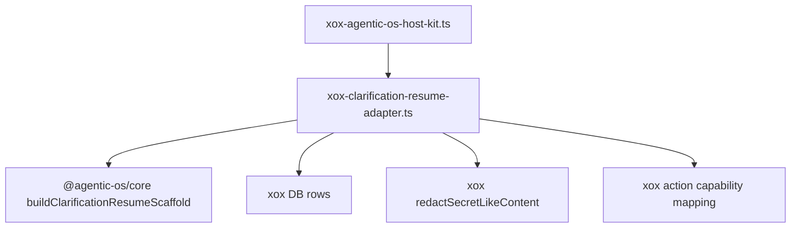

# M113 删除宿主 Clarification Resume Scaffold

Status: implemented and verified
Date: 2026-06-20

## 目标

继续执行“删除宿主 agent 框架”的目标。本轮删除 xox 顶层 `apps/api/src/agent/clarification-resume.ts`，把 clarification resume objective 的通用拼装规则迁入 Agentic OS。

Clarification resume 不是 xox 业务规划器。它属于 agent loop 的恢复入口：用户补充信息、上一轮澄清问题、未满足 findings、已有待确认卡、继续/再澄清规则，必须被稳定地组织成下一轮模型可见 objective，并避免重复生成上一轮确认卡。

## 模块分工

Agentic OS：

- `@agentic-os/core`
  - 新增 `buildClarificationResumeScaffold()`；
  - 统一 open finding 过滤、pending action count 归一化、redaction hook 和 objective line assembly；
  - 提供可定制 copy，让宿主保留本地语言和产品规则。

xox：

- `apps/api/src/agent/agentic-os/xox-clarification-resume-adapter.ts`
  - 查询上一轮 goal/evaluation/action rows；
  - 映射 xox action kind 到 `AgentToolCapability`；
  - 传入 xox 中文 copy 和 `redactSecretLikeContent()`；
  - 返回 host kit 需要的 `resumedGoalId`、`resumedRunId`、`objective`、`satisfiedActionCapabilities`。
- `apps/api/src/agent/host-profile/xox-agent-run-profile.ts`
  - 从 adapter folder 引入 clarification resume context。
- `apps/api/src/agent/clarification-resume.ts`
  - 删除。

## 依赖图



## 验证

```bash
cd C:\Github\agentic-os
npm.cmd run build -w @agentic-os/core
npm.cmd run test -w @agentic-os/core
npm.cmd run check

cd C:\Github\xox-model
npm.cmd run build:api
npm.cmd run test --workspace @xox/api -- tests/agent-architecture.test.ts
npm.cmd run test:api
```

预期：

- Agentic OS core clarification resume tests 通过；
- xox build 证明没有旧 `clarification-resume.ts` import；
- architecture guard 证明旧文件不回流，adapter 不再手写 objective array assembly；
- full API suite 保持 clarification resume、pending confirmation card de-duplication 和目标恢复行为。

已验证（2026-06-20）：

- `npm.cmd run build -w @agentic-os/core` 通过；
- `npm.cmd run test -w @agentic-os/core` 通过：159 tests；
- `npm.cmd run check` 在 `C:\Github\agentic-os` 通过；
- `npm.cmd run build:api` 在 `C:\Github\xox-model` 通过；
- `npm.cmd run test --workspace @xox/api -- tests/agent-architecture.test.ts` 通过：35 tests；
- `npm.cmd run test:api` 通过：14 files，239 tests。

## 完成标准

- `apps/api/src/agent/clarification-resume.ts` 删除；
- `xox-agentic-os-host-kit.ts` 使用 `buildXoxClarificationResumeContext()`；
- resume scaffold 由 `@agentic-os/core` 负责；
- xox 只保留 DB/业务 capability/copy/redaction adapter；
- xox 行为与删除前一致或更好。
