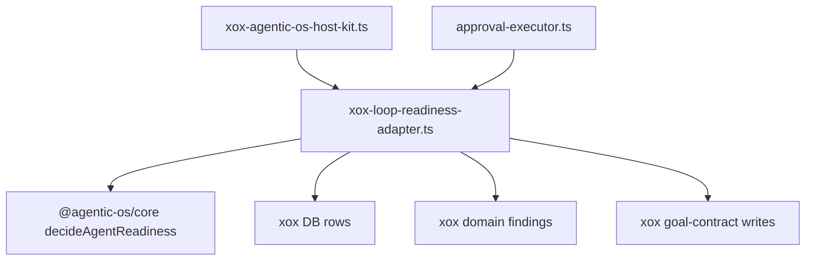

# M114 删除宿主 Loop Readiness Check

Status: implemented
Date: 2026-06-20

## 目标

继续按“删除宿主 agent 框架”推进。本轮删除 xox 顶层 `apps/api/src/agent/loop-readiness-check.ts`。

这个文件目前混合了两类职责：

- xox 业务事实和 finding 生产：DB row 查询、action payload 解析、经营模型/预测/审计/权限检查、中文 finding；
- harness loop readiness 裁决：policy block、terminal failure、clarification wait、repair/continue、pending confirmation、pass 的优先级。

M114 把第二部分迁入 `@agentic-os/core`，xox 只保留第一部分，并移动到 `apps/api/src/agent/agentic-os/xox-loop-readiness-adapter.ts`。

## 模块分工

Agentic OS：

- `@agentic-os/core`
  - 新增 `decideAgentReadiness()`；
  - 统一 readiness status priority；
  - 支持 host copy 注入，保留 xox 中文文案但不把 xox 文案内置到 core。

xox：

- `apps/api/src/agent/agentic-os/xox-loop-readiness-adapter.ts`
  - 保留 xox DB 查询、domain observation、goal fact checks、action capability coverage 和 persistence；
  - 调用 `decideAgentReadiness()` 取得 status/confidence/blocker/nextPlannerBrief；
  - 写回 `agent_evaluations` 和 goal status。
- `apps/api/src/agent/loop-readiness-check.ts`
  - 删除。

## 依赖图



## 验证

```bash
cd C:\Github\agentic-os
npm.cmd run build -w @agentic-os/core
npm.cmd run test -w @agentic-os/core
npm.cmd run check

cd C:\Github\xox-model
npm.cmd run build:api
npm.cmd run test --workspace @xox/api -- tests/agent-architecture.test.ts
npm.cmd run test:api
```

预期：

- Agentic OS core readiness decision 测试通过；
- xox build 证明没有旧 `loop-readiness-check.ts` import；
- architecture guard 证明旧顶层文件不回流；
- full API suite 保持确认卡等待、澄清等待、repair loop 和经营模型 readiness 行为。

## 完成标准

- `apps/api/src/agent/loop-readiness-check.ts` 删除；
- xox host kit 和 approval executor 使用 `xox-loop-readiness-adapter.ts`；
- readiness status priority 由 `@agentic-os/core` 负责；
- xox 只保留 DB/domain/copy/persistence adapter；
- xox 行为与删除前一致或更好。

## 结果

- `@agentic-os/core` 新增并导出 `decideAgentReadiness()`；
- xox 顶层 `apps/api/src/agent/loop-readiness-check.ts` 已删除；
- 剩余 xox DB/domain/persistence 逻辑移动到 `apps/api/src/agent/agentic-os/xox-loop-readiness-adapter.ts`；
- `approval-executor.ts` 和 `xox-agentic-os-host-kit.ts` 均改为导入新 adapter；
- `agent-architecture.test.ts` 已防止旧顶层文件、旧 import 和本地 readiness status priority 分支回流。
