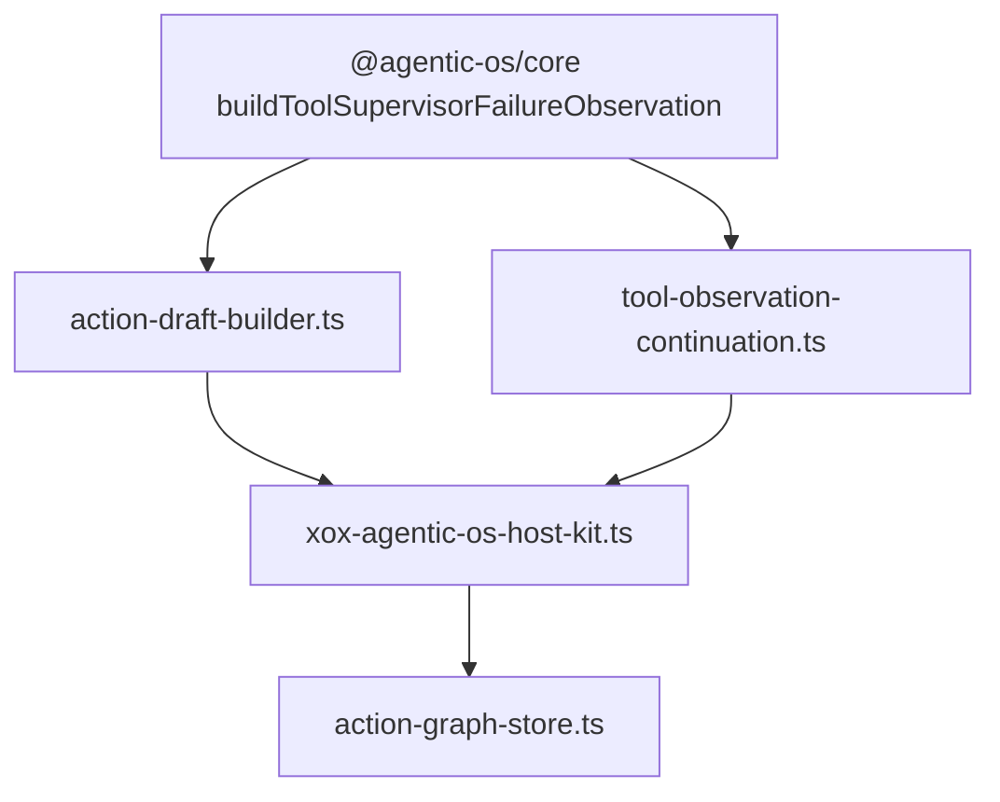

# M117 Tool Supervisor Failure Envelope

Status: implemented
Date: 2026-06-21

## 目标

继续压缩 `apps/api/src/agent/agentic-os/xox-agentic-os-host-kit.ts`。

当前 host kit 在工具调用没有生成业务结果时仍手写 `tool_supervisor_failure` JSON payload。这不是 xox 业务逻辑，而是 Agentic OS 的 tool-call supervision 语义：runner 必须把“工具没有产生可执行动作或 observation”变成模型可见、可审计、fail-closed 的 observation。

xox 应该只保留中文文案、`ReadDraft`/`AgentToolObservation` DTO 映射和 action graph 落库适配。

## 模块分工

Agentic OS：

- `@agentic-os/core`
  - 已提供 `buildToolSupervisorFailureObservation()`；
  - 新增 `buildToolSupervisorEmptyResultFailureObservation()`，由 core 提供 empty-result 的默认模型可读 copy；
  - 拥有 `tool_supervisor_failure` 模型可读 envelope；
  - 统一维护 failed terminal status/outcome。

xox：

- `apps/api/src/agent/action-draft-builder.ts`
  - 新增 `toolSupervisorFailureReadDraft()`；
  - 把 core failure observation 映射成 xox `ReadDraft`。
- `apps/api/src/agent/tool-observation-continuation.ts`
  - 新增 `toolSupervisorFailureObservation()`；
  - 把 core failure observation 映射成 xox `AgentToolObservation`。
- `apps/api/src/agent/agentic-os/xox-agentic-os-host-kit.ts`
  - 删除 `fallbackToolObservation()`；
  - 删除手写 `fallbackItem` 对象；
  - 只调用 DTO adapter。
- `apps/api/tests/agent-architecture.test.ts`
  - 防止 host kit 再写 `tool_supervisor_failure` payload。
- `apps/api/tests/action-observation.test.ts`
  - 验证 xox adapter 保持中文产品文案，同时复用 Agentic OS core envelope。

## 依赖关系



## 验证

```bash
cd C:\Github\xox-model
npm.cmd run build:api
npm.cmd run test --workspace @xox/api -- tests/agent-architecture.test.ts tests/action-observation.test.ts
npm.cmd run test:api

cd C:\Github\agentic-os
npm.cmd run check
```

## 完成标准

- host kit 不再手写 `tool_supervisor_failure` JSON；
- Agentic OS core 是唯一 envelope owner；
- xox 只保留 DTO/中文文案 adapter；
- architecture guard 和 API tests 通过。

## 结果

已于 2026-06-21 完成。

- `@agentic-os/core` 新增 `buildToolSupervisorEmptyResultFailureObservation()`。
- `apps/api/src/agent/action-draft-builder.ts` 只把 core failure observation 映射成 `ReadDraft`。
- `apps/api/src/agent/tool-observation-continuation.ts` 只把 core failure observation 映射成 `AgentToolObservation`。
- `apps/api/src/agent/agentic-os/xox-agentic-os-host-kit.ts` 已删除 `fallbackToolObservation()` 和手写 fallback `PlannedItem`。
- 架构守卫防止 host kit 重新手写 `tool_supervisor_failure` JSON。
