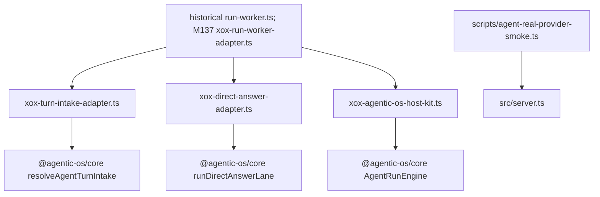

# M130: Delete Host Entry Facades

## Scope

This migration removes host-local files that made xox still look like it owned a standalone agent harness:

- delete `apps/api/src/agent/agent-kernel.ts`;
- delete `apps/api/src/agent/prompt-registry.ts`;
- move `apps/api/src/agent/real-provider-smoke.ts` to `apps/api/scripts/agent-real-provider-smoke.ts`.

The smoke command is preserved. Only its location changes because it is an operational verification script, not a production runtime module.

## Module Boundary

| Responsibility | Owner after M130 |
| --- | --- |
| Durable run queue, lease, cancellation, fail-close DB writes | historical `apps/api/src/agent/run-worker.ts`; M137 moved this to `apps/api/src/agent/agentic-os/xox-run-worker-adapter.ts` |
| Turn intake lane resolution | `apps/api/src/agent/agentic-os/xox-turn-intake-adapter.ts` + `@agentic-os/core` |
| Direct answer lane | `apps/api/src/agent/agentic-os/xox-direct-answer-adapter.ts` + `@agentic-os/core` |
| Main agent loop | `apps/api/src/agent/agentic-os/xox-agentic-os-host-kit.ts` + `@agentic-os/core` |
| xox product prompt text | M153 keeps prompt files under `apps/api/src/agent/host-profile/prompts`; M152's generic `apps/api/src/agent/prompts` directory remains deleted |
| Real provider smoke | `apps/api/scripts/agent-real-provider-smoke.ts` |

## Dependency Graph



## Naming And Style

- No new `kernel`, `registry`, or `runner` host module is introduced.
- Prompt/helper policy assets live under `host-profile/prompts` and are consumed directly by concrete adapters; no generic production `src/agent/prompts` directory remains.
- Architecture tests guard deleted files by exact path.

## Validation

```powershell
npm.cmd run build:api
npm.cmd run test:api -- --run apps/api/tests/agent-architecture.test.ts
npm.cmd run test:api
git diff --check
```

Expected: build, focused architecture guard and full API suite pass.

`npm.cmd run smoke:agent` is still available but remains opt-in because it requires real provider credentials.
