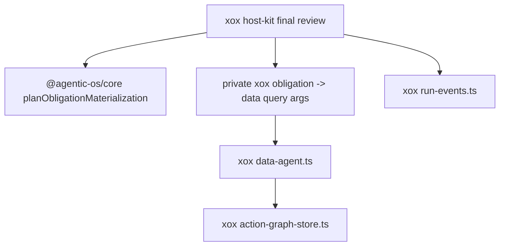

# M131: Delete Obligation Materializer Facade

## Scope

Delete `apps/api/src/agent/obligation-materializer.ts`.

The removed file was a single-ingress host harness facade. Its only production caller was `xox-agentic-os-host-kit.ts`, and the generic part of the work already belongs to Agentic OS:

- active obligation filtering;
- required-tool guarding;
- stable task de-duplication;
- generic materializing/materialized event payloads.

After M131, xox keeps only the host adapter work at the real final-review boundary:

- decide that a xox `domain_fact` obligation can be materialized by `data_query_workspace`;
- construct xox `DataAgentQueryStep` arguments from required scopes/metrics;
- execute the xox read;
- persist xox action graph rows and localized run events.

## Module Boundary

| Responsibility | Owner after M131 |
| --- | --- |
| Obligation materialization planning | `@agentic-os/core planObligationMaterialization()` |
| Generic started/completed materialization payloads | `@agentic-os/core` |
| xox `domain_fact -> data_query_workspace` selection | private helper in `apps/api/src/agent/agentic-os/xox-agentic-os-host-kit.ts` |
| xox data read execution | `apps/api/src/agent/data-agent.ts` |
| xox action/read row persistence | `apps/api/src/agent/action-graph-store.ts` |
| xox durable event storage and Chinese copy | `apps/api/src/agent/run-events.ts` + host-kit call sites |

## Dependency Graph



## Naming And Style

- No `obligation-materializer.ts` file remains under the xox agent tree.
- The remaining xox helpers are private to the host adapter that actually uses them.
- Architecture tests guard the deleted path and forbid importing it back.

## Validation

Run in `C:\Github\xox-model`:

```powershell
npm.cmd run build:api
npm.cmd run test:api -- --run apps/api/tests/agent-architecture.test.ts
npm.cmd run test:api
git diff --check
```

Run in `C:\Github\agentic-os`:

```powershell
npm.cmd run check
git diff --check
```

Expected: all commands pass. The xox final-review repair loop should still materialize required `data_query_workspace` observations when core selects an active materialization task.
