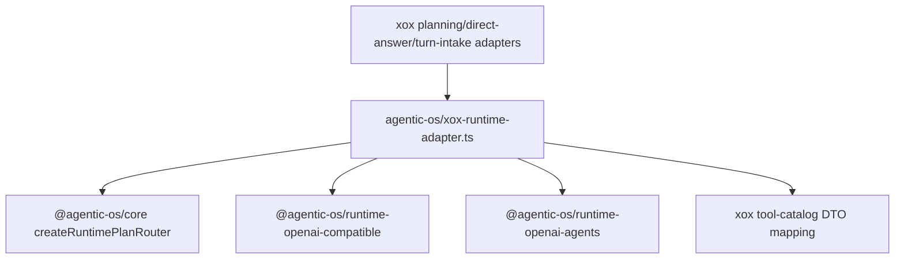

# M132: Delete Host Runtime Directory

## Scope

Delete the last TypeScript runtime file under `apps/api/src/agent/runtime` by moving the remaining xox provider-selection adapter to:

```text
apps/api/src/agent/host-profile/xox-provider-runtime.ts
```

This is intentionally not a copy of Agentic OS runtime internals. The runtime CPU is already in Agentic OS packages:

- `@agentic-os/runtime-openai-compatible`
- `@agentic-os/runtime-openai-agents`
- `@agentic-os/core createRuntimePlanRouter()`

The remaining xox code is host adapter wiring:

- choose a provider route from xox `Settings`;
- map xox `ChatTool` metadata to Agentic OS runtime tool descriptors;
- map canonical provider tool calls into xox planner-step DTOs;
- preserve legacy `RuntimePlanResult` / `RuntimeStreamEvent` DTOs while downstream xox code migrates.

## Module Boundary

| Responsibility | Owner after M132 |
| --- | --- |
| OpenAI-compatible request shaping, transport, stream parsing, provider turn normalization, boundary validation | `@agentic-os/runtime-openai-compatible` |
| OpenAI Agents SDK lifecycle and canonical tool-call capture | `@agentic-os/runtime-openai-agents` |
| Ordered runtime route selection and no-route fail-closed behavior | `@agentic-os/core createRuntimePlanRouter()` |
| xox provider settings policy and legacy planner-step DTO mapping | `apps/api/src/agent/host-profile/xox-provider-runtime.ts` |
| xox planning/finalizer call orchestration and localized run events | `runtime-planning-call.ts`, `tool-observation-continuation.ts`, host adapters |

## Dependency Graph



## Naming And Style

- `apps/api/src/agent/runtime/runtime-adapter.ts` is absent.
- No xox production source imports from `./runtime/runtime-adapter.js` or `../runtime/runtime-adapter.js`.
- The remaining adapter name is explicitly xox-prefixed and lives with other Agentic OS host adapters.

## Validation

Run in `C:\Github\xox-model`:

```powershell
npm.cmd run build:api
npm.cmd run test:api -- --run tests/agent-architecture.test.ts tests/provider-runtime.test.ts tests/agentic-os-adapter.test.ts
npm.cmd run test:api
git diff --check
```

Run in `C:\Github\agentic-os`:

```powershell
npm.cmd run check
git diff --check
```

Expected: all commands pass and `apps/api/src/agent/runtime/runtime-adapter.ts` remains absent.
