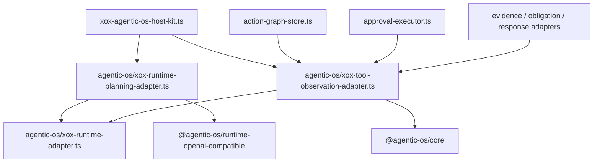

# M133: Delete Root Planning and Continuation Facades

## Goal

Delete the remaining root-level xox files that still read like local harness runner facades:

- `apps/api/src/agent/runtime-planning-call.ts`
- `apps/api/src/agent/tool-observation-continuation.ts`

The behavior must stay unchanged. This slice is a structural amputation: xox keeps xox-specific host adapter wiring, but the `agent` root no longer advertises a local runtime-planning or continuation framework.

## Boundary

Agentic OS already owns the reusable runtime pieces used by these files:

- provider observation turn message assembly;
- provider continuation message assembly;
- provider same-turn planning recovery;
- action preview/result model envelopes;
- tool supervisor empty-result failure envelope;
- continuation system prompt template;
- runtime stream trace projection through the server package.

xox still owns host-specific wiring:

- business context pack construction;
- tool catalog projection and materialization callback;
- high-volume business tool budget policy;
- localized run-event copy and durable SQL append;
- xox action row to observation DTO mapping;
- failure plan-step persistence;
- legacy `AgentToolObservation` DTO shape consumed by xox tests and products.

## Module Plan

| Current root file | New host adapter | Ownership after M133 |
| --- | --- | --- |
| `runtime-planning-call.ts` | `agentic-os/xox-runtime-planning-adapter.ts` | xox planning runtime adapter wiring only |
| `tool-observation-continuation.ts` | `agentic-os/xox-tool-observation-adapter.ts` | xox observation DTO/copy and continuation adapter wiring only |

No duplicate path is allowed. The old root files must be absent and guarded by architecture tests.

## Dependency Graph



## Reuse and Abstraction

This slice must not create a new abstraction. It deliberately performs a rename/move into the existing xox `agentic-os` host adapter area.

The next abstraction target remains Agentic OS packages:

- turn prologue and runtime planning orchestration in `@agentic-os/server`;
- continuation runtime in `@agentic-os/server` or runtime package;
- host observation DTO projection in a future host-profile adapter contract.

## Naming and Style

New files use the xox-prefixed host adapter naming already used by the integration:

- `xox-runtime-planning-adapter.ts`
- `xox-tool-observation-adapter.ts`

The names must make it obvious that these are host adapters, not reusable Agentic OS framework files.

## Validation

Run from `C:\Github\xox-model`:

```powershell
npm.cmd run build:api
npm.cmd run test:api -- --run tests/agent-architecture.test.ts tests/provider-runtime.test.ts tests/action-observation.test.ts tests/response-evaluator.test.ts tests/loop-obligation-ledger.test.ts tests/tool-runtime.test.ts
npm.cmd run test:api
git diff --check
```

Run from `C:\Github\agentic-os`:

```powershell
npm.cmd run check
git diff --check
```

Expected:

- old root files are absent;
- no production or test imports reference the old root paths;
- all commands pass.
