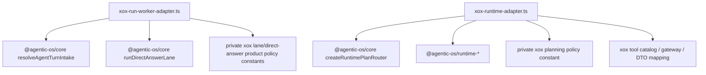

# M152: Delete Host Prompt Assets

Status: implemented and verified
Date: 2026-06-22

## Goal

Delete the remaining production `apps/api/src/agent/prompts` directory.

This is an amputation step, not a semantic rewrite of xox business policy. The problem was architectural shape: a downstream SaaS host that keeps `agent/prompts/*.md` still looks like it owns planner, turn-lane, and direct-answer harness surfaces. For future hosts such as navigation, the desirable integration shape is closer to OpenAI Agents JS `Agent({ instructions, tools })`: the host supplies policy and tools at concrete boundaries, while the runner, lane protocol, tool loop, recovery, event lifecycle, and observation semantics stay in Agentic OS.

## References

- OpenAI Agents JS keeps runtime instructions on the `Agent` configuration and runs them through the SDK runner; it does not require downstream apps to keep a parallel prompt framework directory.
- Hermes keeps prompt assembly in the agent runtime/session layer and treats cache-sensitive prompt construction as harness infrastructure.
- OpenClaw documents that providers own auth/catalog/runtime hooks while core owns the generic loop; plugin/channel code should not recreate the core loop or prompt assembly.

## Deleted Files

- `apps/api/src/agent/prompts/planner.system.md`
- `apps/api/src/agent/prompts/turn-lane.system.md`
- `apps/api/src/agent/prompts/direct-answer.system.md`

After these files are deleted, the production `apps/api/src/agent/prompts` directory must not exist.

## Module Division

Agentic OS owns:

- turn intake protocol and fail-closed lane resolution;
- direct-answer lane state machine;
- provider runtime turn execution, retry/recovery, tool-call normalization, and observation replay;
- generic loop continuation and finalization semantics.

xox owns:

- product identity text and Chinese business tool planning policy;
- tool manifest, schema, capability, and risk policy;
- provider settings, budget policy, and legacy DTO projection at the concrete runtime adapter;
- durable DB rows, permissions, transport, and localized product events.

## Dependency Graph



## Naming And Style

- The retained text is named `XOX_*_PRODUCT_POLICY` or `XOX_PLANNING_POLICY_PROMPT`, not `planner.system.md`.
- The constants are private to the concrete adapter that consumes them.
- No standalone `prompt-registry`, `prompts` directory, or reusable-looking downstream prompt pack remains.

## Validation

Commands:

```powershell
cd C:\Github\xox-model
npm.cmd run build:api
npm.cmd run test --workspace @xox/api -- tests/agent-architecture.test.ts
npm.cmd run test:api
git diff --check
```

Expected:

- TypeScript build passes with no `readFileSync` prompt asset loading in production agent code.
- Architecture guard proves `apps/api/src/agent/prompts` is absent and no source references the deleted prompt filenames.
- Full API behavior remains at least as good as the previous xox harness cut.

Verified on 2026-06-22:

- `npm.cmd run build:api` passed.
- `npm.cmd run test --workspace @xox/api -- tests/agent-architecture.test.ts` passed: 55 tests.
- `npm.cmd run test:api` passed: 11 files, 219 tests.
- `git diff --check` passed.

## Migration Note

This does not mean xox has no product policy. It means product policy is attached to real host boundaries, while Agentic OS continues to absorb the harness semantics. If a future migration moves these constants into Agentic OS host-profile configuration, the move should be accompanied by an Agentic OS API that is reusable by navigation and other SaaS hosts, not by recreating a downstream prompt directory.
