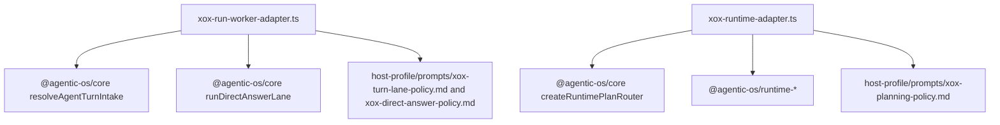

# M153: Host Profile Prompt Assets

Status: implemented and verified
Date: 2026-06-22

## Goal

Correct the overreach in M152.

Prompt text is a content asset. Keeping prompt files in a dedicated folder is good for review, diff, localization and future host-profile packaging. The boundary problem was not "prompt files exist"; the problem was the generic downstream shape `apps/api/src/agent/prompts/planner.system.md`, `turn-lane.system.md`, and `direct-answer.system.md`, which made xox look like it still owned a reusable harness prompt framework.

M153 keeps the useful part of M152:

- no generic `apps/api/src/agent/prompts` directory;
- no generic `planner.system.md`, `turn-lane.system.md`, or `direct-answer.system.md` files;
- no prompt registry or local harness prompt pack.

M153 corrects the overreach:

- xox product policy prompt text returns to markdown files;
- the files live under `apps/api/src/agent/host-profile/prompts`;
- filenames are explicitly host-owned product policy assets:
  - `xox-planning-policy.md`
  - `xox-turn-lane-policy.md`
  - `xox-direct-answer-policy.md`

## Module Division

Agentic OS owns:

- agent loop and lane protocol;
- direct-answer lane state machine;
- provider runtime execution, recovery, and observation replay;
- generic event lifecycle, finalization, readiness and evidence semantics.

xox owns:

- product/business prompt policy text;
- host profile prompt asset packaging;
- provider settings and business tool planning policy at concrete runtime boundaries;
- durable store, transport, localized copy and product DTO projection.

## Dependency Graph



## Naming And Style

- Prompt files are named as host product policy, not generic harness system prompts.
- Runtime code may load host-profile prompt assets directly at the consuming adapter boundary.
- Architecture tests allow `agent/host-profile/prompts` and continue to reject `agent/prompts` plus old generic prompt names.

## Validation

```powershell
cd C:\Github\xox-model
npm.cmd run build:api
npm.cmd run test --workspace @xox/api -- tests/agent-architecture.test.ts
npm.cmd run test:api
git diff --check
```

Expected:

- Build passes with prompt text loaded from `host-profile/prompts`.
- Architecture guard rejects generic prompt framework paths while allowing host-profile assets.
- Full API behavior remains identical to M152.

Verified on 2026-06-22:

- `npm.cmd run build:api` passed.
- `npm.cmd run test --workspace @xox/api -- tests/agent-architecture.test.ts` passed: 55 tests.
- `npm.cmd run test:api` passed: 11 files, 219 tests.
- `git diff --check` passed.
