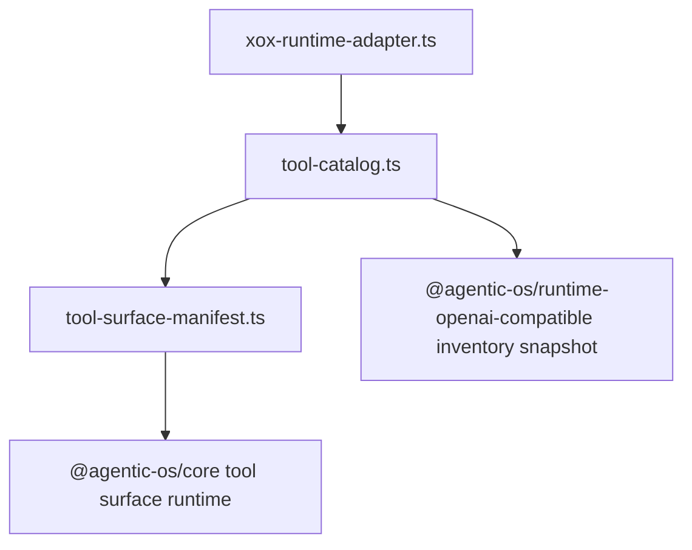

# M154: Delete Tool Gateway Facade

Status: verified
Date: 2026-06-22

## Goal

Delete `apps/api/src/agent/tool-gateway.ts`.

The file no longer owned a real gateway. Its remaining responsibilities were xox tool catalog projection, effective inventory snapshot creation, progressive tool surface selection, and the `tool_catalog_ready` product event. Those are host tool-catalog duties, not a separate downstream harness runtime. Keeping a root `tool-gateway.ts` file made xox look like it still owned a Tool Runtime Gateway that future hosts could copy.

## Boundary

Agentic OS owns:

- provider runtime execution;
- tool-call normalization and boundary validation;
- effective tool inventory snapshot shape in `@agentic-os/runtime-openai-compatible`;
- progressive tool surface algorithms in `@agentic-os/core`.

xox owns:

- business tool registry and tool metadata;
- product tool catalog projection;
- localized `tool_catalog_ready` event copy;
- sandbox nested-call bridge mapping through the host tool catalog.

## Module Division

- `tool-catalog.ts`
  - now owns `buildRuntimeToolCatalogProjection()`, `provideRuntimeToolCatalog()`, and `materializedToolInventorySnapshot()`;
  - remains the single xox tool registry/catalog boundary.
- `agentic-os/xox-runtime-adapter.ts`
  - imports tool catalog projection functions from `tool-catalog.ts`;
  - continues to call Agentic OS runtime packages for provider execution.
- `tool-gateway.ts`
  - deleted and guarded from returning.

## Dependency Graph



## Validation

```powershell
cd C:\Github\xox-model
npm.cmd run build:api
npm.cmd run test --workspace @xox/api -- tests/agent-architecture.test.ts
npm.cmd run test:api
git diff --check
```

Expected:

- `apps/api/src/agent/tool-gateway.ts` is absent.
- Runtime adapter and tests import tool projection from `tool-catalog.ts`.
- Full API behavior is unchanged.
