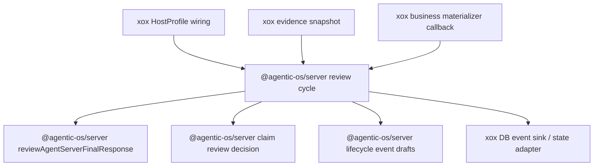

# M165: Final Response Review Cycle Runner

Status: Implemented

Date: 2026-06-23

## Goal

Remove final-response review cycle orchestration from
`apps/api/src/agent/host-profile/xox-agent-run-profile.ts`.

The host profile may provide xox facts, evidence records, localized copy,
durable stores, and business materializers. It must not decide the harness
sequence for:

- pre-review versus claim-grounded review;
- whether claim extraction is worth running;
- final-reviewed / response-evaluated event emission order;
- whether response obligations may be materialized;
- re-review after materialization.

Those are Agentic OS server harness responsibilities.

## Module Division

Agentic OS server owns:

- `runAgentServerFinalResponseReviewCycle()`;
- pre-review, claim-review decision, optional claim extraction, final review
  event emission, optional obligation materialization, and re-review;
- stable phase names: `initial` and `after_materialization`;
- event payload shape for `final_answer_candidate`, `agentic_os.final_reviewed`,
  and `response_evaluated`.

xox host profile owns:

- building the current evidence snapshot from xox observations;
- xox evidence classification and legacy `ResponseEvaluation` DTO mapping;
- claim extraction runtime callback, subject vocabulary, and localized copy;
- business materialization by running `data_query_workspace`;
- applying materialized xox action graph rows to local state;
- DB event append sink and Chinese copy hooks.

## Dependency Graph



## Reuse Plan

- Reuse existing `reviewAgentServerFinalResponse()` instead of exposing core
  final evidence gates to xox.
- Reuse existing `runAgentServerFinalAnswerClaimExtraction()` through a host
  callback; the cycle only decides when to call it.
- Reuse existing `shouldMaterializeAgentServerFinalResponseObligations()` inside
  server cycle; xox must not import it.
- Reuse existing xox `materializeLoopObligations()` as a temporary business
  materializer callback. A later cut can split generic materialization task
  running further into Agentic OS.

## Naming Rules

xox must not contain:

- `decideAgentServerFinalAnswerClaimReview`;
- `shouldMaterializeAgentServerFinalResponseObligations`;
- `agentServerRunLifecycleEvents.finalAnswerCandidate(`;
- `agentServerRunLifecycleEvents.finalReviewed(`.

xox may contain:

- `runAgentServerFinalResponseReviewCycle`;
- `reviewXoxFinalResponseWithAgenticOsServer` as the xox DTO/copy adapter;
- `materializeLoopObligations` until the next materializer-runner cut.

## Validation

```powershell
cd C:\Github\agentic-os
npm.cmd run check
git diff --check

cd C:\Github\xox-model
npm.cmd run build:api
npm.cmd run test:api -- --run tests/agent-architecture.test.ts
npm.cmd run test:api
git diff --check
```

Results on 2026-06-23:

- `C:\Github\agentic-os`: `npm.cmd run check` passed.
- `C:\Github\agentic-os`: `git diff --check` passed.
- `C:\Github\xox-model`: `npm.cmd run build:api` passed.
- `C:\Github\xox-model`: `npm.cmd run test:api -- --run tests/agent-architecture.test.ts` passed, 56 tests.
- `C:\Github\xox-model`: `npm.cmd run test:api` passed, 220 tests.
- `C:\Github\xox-model`: `git diff --check` passed.
