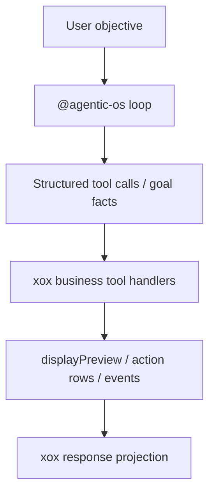

# M166: Remove Host Profile Hardcoded Heuristics

Status: Implemented

Date: 2026-06-23

## Goal

Delete local string/enum heuristics from
`apps/api/src/agent/host-profile/xox-agent-run-profile.ts`.

The xox host profile must not infer harness behavior from objective text,
plan-row copy, or duplicated observation scope renderers. Agentic OS owns loop
control; xox may keep structured business tool schemas, tool manifests, and
domain policy declared at the tool/profile boundary.

## Module Division

xox host profile may keep:

- structured goal facts already stored in `agent_goals.contract_json`;
- structured tool call arguments selected by the model;
- product copy returned by concrete tool handlers;
- durable row and event sinks.

xox host profile must not keep:

- `objectiveImpliesForecastOnly()` style keyword guessing;
- `objectiveRequiresActionWrite()` style write-intent guessing;
- `shouldCollectPendingActionsBeforePause()` style pause behavior guessing;
- fixed prerequisite tool argument constants hidden in the runner;
- final assistant text built by locally enumerating observation scopes;
- result finalization branches that inspect `row.title.includes(...)` or
  `row.description.includes(...)`.
- worker-owned `direct_answer` / `turn_lane` execution branches;
- worker-owned run completion/failure/cancellation message selection.

## Dependency Graph



## Implementation

- Removed objective-text collection heuristics from `osRunInput()` metadata.
- Removed forecast-only keyword normalization; `workspace_update_online_factor`
  now honors only structured `mode` from the tool call.
- Removed fixed `ENTITY_SUMMARY_TOOL_ARGUMENTS`; prerequisite entity reads are
  produced from the prerequisite spec id/data scope.
- Removed `readableObservationText()` scope enum renderer; final display uses
  the tool handler's persisted `displayPreview`.
- Removed objective keyword write/sandbox inference; final-answer supporting
  observation checks now use structured goal facts and action capabilities.
- Removed finalization branches that inspect plan-row Chinese copy for account
  or provider configuration failures.
- Removed host-side prerequisite runner, observation continuation/finalizer
  runner, and missing-observation repair branches from the run profile.
- Removed worker-owned `executeXoxDirectAnswerLane()` and turn-lane resolver
  flow. Direct-answer remains an Agentic OS-owned harness capability; xox keeps
  `xox-turn-lane-policy.md` and `xox-direct-answer-policy.md` only as HostPolicy
  prompt assets for Agentic OS, not as worker-executed lanes.
- Added `@agentic-os/server` run completion projection so xox worker consumes
  Agentic OS `AgentRunResult.status` instead of deriving run failure/completion
  from goal status, action counts, or localized message heuristics. The same
  projection now owns optional terminal assistant text; xox worker only persists
  it when Agentic OS returns it.
- Added Agentic OS dynamic tool authority support. xox declares
  `workspace_update_online_factor(mode=forecast)` as a structured read-mode
  business tool, while Agentic OS decides whether the validated input runs as
  read or confirmation-write.
- Added Agentic OS pre-write duplicate suppression. Repeated pending write
  tool calls pause for the existing confirmation instead of creating another
  xox action row; repeated auto-executed write tool calls become canonical
  observations instead of executing the same business write again.
- Added Agentic OS server stale-final protection. If final-response review
  materializes new observations/evidence, the previous final-answer candidate
  must re-enter the loop as `needs_final_answer`; xox no longer patches this
  with a local finalizer path.

## Validation

```powershell
cd C:\Github\xox-model
npm.cmd run build:api
npm.cmd run test:api -- --run tests/agent-architecture.test.ts
npm.cmd run test:api
git diff --check
```

Observed validation on 2026-06-23:

- `npm.cmd run build --workspace @agentic-os/contracts`
- `npm.cmd run build --workspace @agentic-os/core`
- `npm.cmd run test --workspace @agentic-os/core`
- `npm.cmd run build --workspace @agentic-os/server`
- `npm.cmd run test --workspace @agentic-os/server`
- `npx.cmd vitest run tests/agent-architecture.test.ts`
- `npm.cmd run build --workspace @xox/api`
- `npx.cmd vitest run tests/api.test.ts` (93/93)
