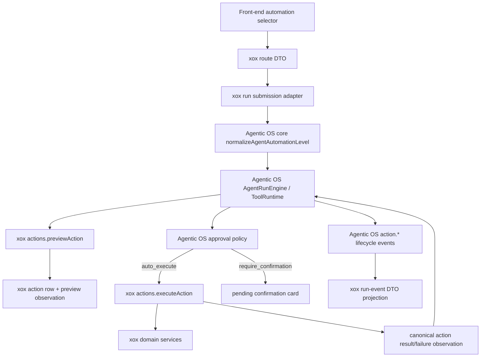

# M167 Agentic OS-Owned Auto Execution

## Requirement

`xox-model` must not own automatic execution policy or the automatic execution runner. The host may expose a front-end automation level selector and may persist that value on a run, but the decision `auto_execute` / `require_confirmation` / `forbidden` is Agentic OS harness work.

This keeps the product boundary aligned with the current Agentic OS target:

- Agentic OS is the complete SaaS harness computer: loop, tool authority, confirmation lifecycle, auto-execution decision, audit contract, observation return, and recovery semantics.
- xox is a host peripheral: business tool catalog, action draft builders, domain validation, Kysely row mapping, localized product copy, and final DTO projection.

## Boundary

| Concern | Owner | Notes |
| --- | --- | --- |
| `automationLevel` normalization | Agentic OS core | xox imports `normalizeAgentAutomationLevel()` from `@agentic-os/core`. |
| Write approval policy | Agentic OS core | `composeAgentWriteApprovalPolicy()` is not called from xox production code. |
| Auto-execution decision | Agentic OS ToolRuntime | Runs after `previewAction()` and before `executeAction()`. |
| Business action execution | xox action port | Calls xox domain services and updates xox durable rows. |
| Execution failure row mapping | xox action port | Converts business failures to failed action rows and canonical action failure observations. |
| Action lifecycle events | Agentic OS ToolRuntime / ActionRuntime | Automatic execution and manual confirmation both emit standard `action.*` events. |
| Product events and DTOs | xox store/projection adapters | Localized copy only; event semantics come from Agentic OS standard action events. |

## Module Division



## Dependency Rules

- `apps/api/src/agent/tool-policy.ts` may validate xox action kind, minimum risk declaration, visible navigation, tenant ownership, and business payload constraints.
- `tool-policy.ts` must not export or implement `resolveActionAuthority`, `normalizeAgentAutomationLevel`, or any `auto_execute` branch.
- `apps/api/src/agent/agentic-os/xox-action-graph-adapter.ts` may persist pending action rows and plan steps, but must not call a local auto-execute helper.
- `apps/api/src/agent/tool-executor.ts` may execute business actions, but must not expose `autoExecuteAgentActionRequest`.
- `apps/api/src/agent/host-profile/xox-agent-run-profile.ts` may implement the `AgentActionPort`; it must return executed or failed action results to Agentic OS instead of constructing automatic-execution lifecycle events.
- `apps/api/src/agent/agentic-os/xox-run-event-store-adapter.ts` may localize Agentic OS `action.*` events into xox run-event DTOs, but it must not distinguish an auto-executed action from a manually confirmed action by owning a second authority policy.

## Validation

Required checks:

```powershell
npx.cmd vitest run tests/agent-architecture.test.ts
npm.cmd run build --workspace @xox/api
npx.cmd vitest run tests/api.test.ts
```

Expected behavior:

- medium automation still auto-executes eligible medium-risk write actions through Agentic OS.
- high automation still keeps high-risk draft updates pending unless Agentic OS policy permits them.
- failed business execution returns a failed action observation rather than leaving a pending card behind.
- architecture tests reject local xox authority resolvers, auto-execute helpers, HostProfile `auto_execute` checks, and `action_auto_*` event branches.

## Alignment

This replaces the older host-owned “Automation Policy Engine” shape from xox ADR 0015 with the Agentic OS-owned action lifecycle. The old user-facing product behavior remains: the front end passes an automation level, manual confirmation cards remain editable, and eligible actions can still execute automatically. The ownership changes: xox no longer decides when automation is allowed.
