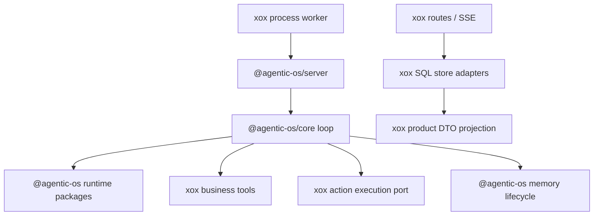

# M169: Delete Host Harness Pillars

## Goal

`xox-model` must stop looking like it owns an agent harness. After this slice, `apps/api/src/agent` should only expose host peripherals: business tools, prompts, store adapters, provider settings, tenant context, and product projections. Agent loop, provider recovery, goal/readiness lifecycle, memory lifecycle, final review orchestration, action graph materialization, and transcript projection belong to Agentic OS.

The architectural target is:

- Agentic OS is the SaaS harness machine.
- xox is data disk, memory device, display, and peripheral drivers.
- xox can observe and persist Agentic OS facts, but must not decide how the harness loop runs.

## Module Division

### Agentic OS

- Owns canonical run loop through `AgentRunEngine` / `createAgentServer`.
- Owns provider turn execution, retry/recovery, stream parsing, and runtime observation repair through runtime packages.
- Owns final response review-cycle ordering and evidence/obligation repair protocol.
- Owns memory kernel policy and should own memory lifecycle services.
- Owns action graph materialization and transcript/AG-UI projection primitives.

### xox-model

- Keeps xox tool catalog, business tool handlers, action draft builders, and action execution.
- Keeps provider key/model settings and tenant authorization.
- Keeps SQL row adapters for runs, events, actions, goals, memories, and thread state.
- Keeps xox prompts and domain policy text.
- Keeps product DTO, Chinese copy, navigation, and UI compatibility mapping.

## Dependency Graph

Forbidden reverse dependencies:

- xox route/worker/profile code must not call local goal/readiness evaluators as loop control.
- xox must not call local provider runtime planning recovery facades.
- xox must not run memory compaction/flush/dreaming from run finalization.
- xox must not construct local final-review cycles.

## Deletion Targets

Hard-delete or collapse:

- `apps/api/src/agent/host-profile/xox-agent-run-profile.ts`
- `apps/api/src/agent/host-profile/xox-provider-runtime.ts`

Severely shrink or convert to durable adapters only:

- `apps/api/src/agent/agentic-os/xox-goal-store-adapter.ts`
- `apps/api/src/agent/memory.ts`
- `apps/api/src/agent/agentic-os/xox-run-worker-adapter.ts`
- `apps/api/src/agent/agentic-os/xox-thread-store-adapter.ts`
- `apps/api/src/agent/tool-catalog.ts`
- `apps/api/src/agent/sandbox-service.ts`

Allowed residual host files:

- `tool-catalog.ts`, `tool-executor.ts`, `tool-policy.ts`
- action draft builders
- provider settings
- route shell
- SQL/event/thread/action/memory store adapters
- host-profile prompts

## Validation

Expected checks:

- `npm.cmd run build --workspace @xox/api`
- `npm.cmd run test --workspace @xox/api -- tests/agent-architecture.test.ts`
- `npm.cmd run test --workspace @xox/api`
- `npm.cmd run check` in `C:/Github/agentic-os`

Architecture tests must guard deleted host harness files from returning.

## Execution Result

Implemented in this slice:

- Deleted whole-file host harness pillars:
  - `apps/api/src/agent/host-profile/xox-agent-run-profile.ts`
  - `apps/api/src/agent/host-profile/xox-provider-runtime.ts`
  - `apps/api/src/agent/host-profile/xox-final-review-policy.ts`
  - `apps/api/src/agent/host-profile/xox-goal-facts.ts`
  - `apps/api/src/agent/agentic-os/xox-goal-store-adapter.ts`
  - `apps/api/tests/provider-runtime.test.ts`
- Added one thin host wiring file:
  - `apps/api/src/agent/host-profile/xox-host-profile.ts`
- Removed xox-local memory lifecycle orchestration from `memory.ts` and routes:
  - action/evaluator/goal memory candidate generation;
  - memory candidate consolidation;
  - long-context memory flush;
  - recall-signal promotion ranking;
  - dreaming sweep generation;
  - automatic memory candidate writes from action edit/cancel routes.
- Removed xox-local tool surface runtime projection from `tool-catalog.ts`:
  - `buildRuntimeToolCatalogProjection()`;
  - `provideRuntimeToolCatalog()`;
  - local inventory snapshot/progressive discovery event wiring;
  - runner-obligation tool filtering.
- Removed old local goal/obligation context fields from `PlannerContext`.
- Updated tests so xox no longer asserts local provider runtime, local goal facts, local memory lifecycle, or local progressive tool runtime behavior.

Current allowed xox agent surface after this slice:

- business tool catalog and business tool execution;
- action draft DTO builders and durable action rows;
- provider settings/key source and probe route;
- context pack, prompt assets, Memory Center/store/display, sandbox workspace bundles;
- SQL/SSE/route adapters and product DTO projection.

M170 supersedes the earlier allowance for `tool-surface-manifest.ts` and `host-profile/xox-context-pack.ts`: both files are now deleted, and xox no longer exposes `tool_discover` / `rg` or automatic memory recall as local harness behavior.

Current forbidden xox surface after this slice:

- provider runtime runner files;
- local final review/evidence gate;
- local goal/readiness store adapter;
- local memory lifecycle candidate/flush/dreaming orchestration;
- local progressive tool runtime/catalog event projection;
- local loop obligation plan state.

Verified on 2026-06-23:

- `npm run build:api` passed.
- `npx vitest run apps/api/tests/agent-architecture.test.ts apps/api/tests/tool-context-engine.test.ts apps/api/tests/tool-runtime.test.ts apps/api/tests/sandbox-tool.test.ts` passed: 34 tests.
- `npx vitest run apps/api/tests/agentic-os-adapter.test.ts apps/api/tests/agent-architecture.test.ts` passed: 12 tests.
- `npm run test --workspace @xox/api -- api.test.ts -t "enforces Agent tool policy"` passed.
- `npm run test:api` failed after the deletion cut: 109 passed, 27 failed.

Remaining validation risk:

- Full API failures are now known and classified as migration follow-up, not a reason to restore deleted xox harness code.
- Stale local-harness expectations:
  - `agent_goals` / `agent_evaluations` row assertions and `response_evaluated` / final-review lifecycle events from the deleted goal/final-review store.
  - local progressive tool surface expectations such as hidden provider tools, deferred materialization, `tool_catalog_ready`, retry materialization, and selected-tool provider retry flows.
  - local memory recall signal promotion expectations after removal of xox-owned recall-signal lifecycle writes.
- Real Agentic OS parity gaps to solve upstream or through thin ports:
  - provider runtime retry behavior for malformed streamed arguments, timeouts, and `tool_choice` rejection must be owned by Agentic OS runtime packages;
  - final response/readiness/evidence lifecycle needs Agentic OS-owned projection if xox frontend still needs equivalent DTOs;
  - operating-model action de-duplication and complex-goal continuation should move to Agentic OS action graph/readiness primitives or remain as explicit business action-draft policy, not as a local runner.
- Do not reintroduce deleted xox harness logic to satisfy these tests. Update stale xox tests or add Agentic OS package tests for generic harness behavior.

## Alignment

This follows the user requirement that `xox-model` provides tools/skills/prompts and observes Agentic OS output, while Agentic OS owns the harness self-loop. It also follows the accumulated lesson that whole-file deletion is the migration success shape, not helper count.
