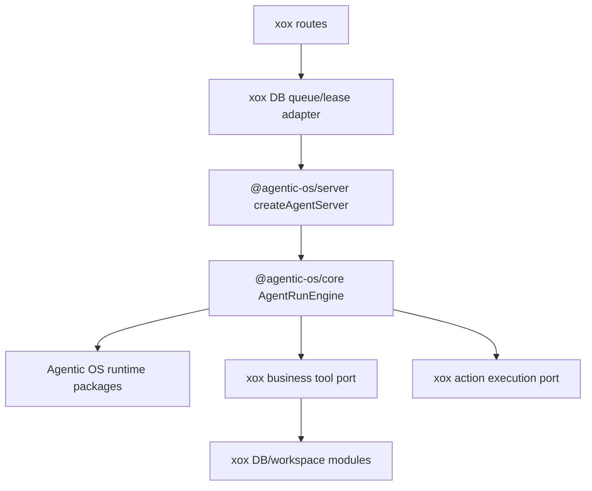

# M170: Delete Host Orchestration Residue

## Goal

This slice removes the remaining xox-owned harness residue from `apps/api/src/agent`.

The boundary is strict:

- Agentic OS owns the run loop, context/memory selection, tool surface runtime, provider turn lifecycle, action runtime, final review, recovery, and generic events.
- xox owns business tools, prompt assets, SaaS auth/storage, provider settings, workspace bundles, action DTOs, product copy, routes, and display projection.

## Module Division

### Agentic OS

- `@agentic-os/core` supplies `AgentRunEngine`, tool inventory, memory kernel primitives, tool runtime, completion evaluation, and observation bridges.
- `@agentic-os/server` supplies `createAgentServer`, run completion projection, scheduler primitives, and run-plane lifecycle.
- `@agentic-os/runtime-*` supplies provider turn execution and provider repair.

### xox-model

- `host-profile/xox-host-profile.ts` may expose a HostAdapter/Profile and xox DTO adapters only.
- `agentic-os/xox-run-worker-adapter.ts` may own DB queue/lease plumbing only.
- `tool-catalog.ts` may own business tool declarations only.
- `tool-executor.ts` may execute business tools only.
- `sandbox-service.ts` may provide workspace bundle and business SDK surface only.
- `memory.ts` may remain a DB/Memory Center/tool-store adapter, not an automatic recall lifecycle owner.

## Dependency Graph



Forbidden:

```text
xox host files -> create local run kit / own context recall / expose tool_discover kernel tools / own generic tool surface runtime
```

## One-Shot Deletions

- Delete `apps/api/src/agent/host-profile/xox-context-pack.ts`.
- Delete `apps/api/src/agent/tool-surface-manifest.ts`.
- Remove xox-visible `tool_discover` and `rg` provider tools.
- Remove xox-local active memory recall from context assembly.
- Replace direct `createAgentHostKit()` usage in xox execution paths with `createAgentServer()`.

## Required Residual Shape

- xox context is a plain facts adapter: current date, workspace objects, versions, periods, ledger subjects, writable config hints, recent conversation log, and provided artifact summary.
- Memory recall becomes Agentic OS-owned future work; xox retains Memory Center routes and explicit `memory_search/get/remember` business tools only.
- Sandbox SDK docs are generated directly from `AGENT_TOOL_REGISTRY`; no xox tool-surface runtime file remains.
- Architecture tests must fail if the deleted files, `tool_discover`, `rg`, or `createAgentActiveMemoryRecallRuntime` return.

## Validation

Run:

```powershell
npm.cmd run build:api
npx.cmd vitest run apps/api/tests/agent-architecture.test.ts apps/api/tests/sandbox-tool.test.ts apps/api/tests/tool-runtime.test.ts
npm.cmd run test:api
```

Full API parity failures after this cut must not be fixed by restoring xox harness code. They must be classified as stale local-harness expectations or Agentic OS upstream parity work.

## Execution Result

Implemented in this slice:

- Deleted `apps/api/src/agent/host-profile/xox-context-pack.ts`.
- Deleted `apps/api/src/agent/tool-surface-manifest.ts`.
- Deleted stale local harness tests:
  - `apps/api/tests/tool-context-engine.test.ts`
  - `apps/api/tests/agentic-os-adapter.test.ts`
- Removed xox-visible `tool_discover` and `rg` provider tools from `tool-catalog.ts`.
- Removed `tool.discover` / `tool.rg` business handlers from `tool-executor.ts`.
- Removed `RuntimePlanResult`, `RuntimePlanError`, and provider-error-to-read-draft projection from `host-profile/xox-planned-items.ts`.
- Replaced direct `createAgentHostKit()` calls in xox run execution with `@agentic-os/server` `createAgentServer()`.
- Removed automatic memory recall from xox context assembly. xox now keeps Memory Center and explicit memory tools only.
- Changed sandbox SDK documentation generation to read directly from `AGENT_TOOL_REGISTRY`, without a xox tool-surface runtime file.
- Updated xox planning prompt so it no longer teaches `tool_discover`, `rg`, or implicit `tenantScopedMemory`.

Current allowed xox agent surface after this slice:

- business tool registry and tool execution;
- action draft DTO builders and durable action rows;
- provider settings/key source and provider runtime port adapter;
- plain host facts context assembly;
- prompt assets;
- Memory Center/store/display and explicit memory tools;
- sandbox workspace bundle and business SDK surface;
- SQL/SSE/route adapters and product DTO projection.

Current forbidden xox surface after this slice:

- standalone context-pack harness file;
- xox-owned active memory recall lifecycle;
- xox-owned progressive tool surface runtime;
- model-visible harness kernel tools such as `tool_discover` and `rg`;
- local provider planning result DTOs such as `RuntimePlanResult`;
- direct host-kit run execution from xox execution paths.

Verified on 2026-06-23:

```powershell
npm.cmd run build:api
# passed

npx.cmd vitest run apps/api/tests/agent-architecture.test.ts apps/api/tests/sandbox-tool.test.ts apps/api/tests/tool-runtime.test.ts
# passed: 3 files, 29 tests

npm.cmd run test:api
# failed: 98 passed, 29 failed
```

Full API failure classification:

- stale xox-local goal/evidence/final-review expectations: tests still assert `agent_goals`, `agent_evaluations`, `response_evaluated`, claim-review, readiness, and obligation rows/events previously produced by deleted host harness code;
- stale provider runtime shape expectations: tests still assert xox-owned retry stream shapes, selected-tool retries, `tool_choice` fallbacks, and provider budget decisions that must be verified in Agentic OS runtime packages;
- stale memory injection expectations: tests still assert `memory_recall_*`, `memory_injected`, and `tenantScopedMemory` context injection after xox active recall was deleted;
- real Agentic OS parity gaps to solve upstream or through thin ports: complex-goal continuation/readiness, operating-model action de-duplication, final review projection, and provider retry parity.

Do not restore deleted xox harness files or tools to make those full API tests pass. The next green path is either to move the missing generic behavior into Agentic OS packages with tests, or to update stale xox integration tests so they assert the new computer/peripheral boundary.
