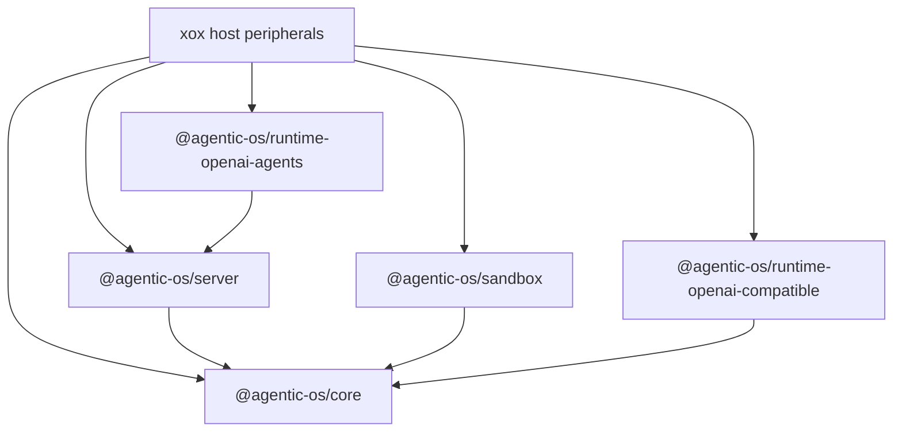

# M177 Five Boundary Amputation

Status: Implemented for this slice

Date: 2026-06-25

## Goal

Finish the next five host-harness deletions from `apps/api/src/agent`.

Agentic OS is the complete SaaS harness computer. xox-model is a downstream host that supplies data, tools, prompts, durable rows, product DTOs, and transport. xox must not own provider runtime assembly, sandbox execution semantics, memory kernel semantics, generic action graph projection, or worker recovery lifecycle.

## Module Plan

### 1. HostProfile runtime/provider/sandbox/memory assembly

Edit:

- `C:/Github/agentic-os/packages/server/src/index.ts`
- `C:/Github/xox-model/apps/api/src/agent/host-profile/xox-host-profile.ts`
- `C:/Github/xox-model/apps/api/tests/agent-architecture.test.ts`

Move to Agentic OS:

- SaaS runtime router/factory entrypoint.
- Runtime stream/recovery event projection hooks.
- Sandbox port projection from canonical host observations.
- Active-memory context source event lifecycle.

Keep in xox:

- provider settings values and prompt policy;
- tool catalog mapping to xox planner steps;
- DB-backed run/action/store ports;
- localized copy as data.

### 2. Sandbox result/read/aggregate projection

Edit:

- `C:/Github/agentic-os/packages/sandbox/src/tool-loop.ts`
- `C:/Github/agentic-os/packages/sandbox/src/index.ts`
- `C:/Github/xox-model/apps/api/src/agent/sandbox-service.ts`

Move to Agentic OS:

- model-readable sandbox observation content;
- completed/failed sandbox read facts;
- structured tool-call projection;
- evidence proof/status/output checks.

Keep in xox:

- uploaded file inspection;
- workspace data bundle construction;
- manifest policy and business SDK exposure;
- xox `ReadDraft` and aggregate action DTO final shape.

### 3. Memory kernel semantics

Edit:

- `C:/Github/agentic-os/packages/server/src/index.ts`
- `C:/Github/xox-model/apps/api/src/agent/memory.ts`
- `C:/Github/xox-model/apps/api/src/agent/tool-executor.ts`

Move to Agentic OS:

- tenant memory retrieval ranking invocation;
- memory search/get tool projection;
- memory citation construction;
- memory item summaries.

Keep in xox:

- SQL row access;
- tenant/workspace/user authorization;
- Memory Center CRUD and product DTOs.

### 4. Action graph materializer/projection

Edit:

- `C:/Github/agentic-os/packages/server/src/index.ts`
- `C:/Github/xox-model/apps/api/src/agent/agentic-os/xox-action-graph-adapter.ts`

Move to Agentic OS:

- planned item to action graph item conversion;
- generic read observation materialization;
- plan status mapping where it is host-neutral;
- event draft generation.

Keep in xox:

- action request row insert/update;
- plan step row insert;
- legacy xox status/DTO compatibility;
- localized run-event persistence.

### 5. Worker recovery lifecycle

Edit:

- `C:/Github/agentic-os/packages/server/src/index.ts`
- `C:/Github/xox-model/apps/api/src/agent/agentic-os/xox-run-worker-adapter.ts`

Move to Agentic OS:

- interrupted run completion projection;
- fail-closed recovery event/message composition;
- queued run completion update protocol;
- worker lifecycle decision sequence.

Keep in xox:

- SQL lease claim;
- row loading and authorization;
- durable status writes;
- localized copy and thread signal transport.

## Dependency Graph



Runtime package imports may remain in xox only at the single provider boundary if the current package graph prevents server from depending on concrete runtime packages. They must not remain in `xox-host-profile.ts` as local runner logic.

Implementation note: this slice introduces `@agentic-os/runtime-openai-agents` `createOpenAISaaSRuntimeAdapter()`. The first downstream host no longer directly constructs `createOpenAICompatiblePlanningRuntimeAdapter()` or `createOpenAIAgentsRuntimeAdapter()` from `xox-host-profile.ts`.

## Naming Rules

- New reusable APIs use `AgentServerSaaS*`, `AgentServer*Projection`, or `AgenticSandbox*`.
- xox residuals must be named as durable store, business tool, product DTO, or host profile input adapters.
- Do not create new xox files whose names imply local harness ownership.

## Validation

Expected commands:

```bash
cd C:/Github/agentic-os
npm run build -w @agentic-os/core
npm run build -w @agentic-os/server
npm run build -w @agentic-os/sandbox
npm run build -w @agentic-os/runtime-openai-compatible
npm run build -w @agentic-os/runtime-openai-agents
npm run test -w @agentic-os/server
npm run test -w @agentic-os/sandbox
npm run test -w @agentic-os/runtime-openai-agents

cd C:/Github/xox-model
npm run build:api
cd C:/Github/xox-model/apps/api
npx vitest run tests/agent-architecture.test.ts
npx vitest run tests/action-observation.test.ts
```

Actual commands passed on 2026-06-25:

```bash
cd C:/Github/agentic-os
npm run build -w @agentic-os/core
npm run build -w @agentic-os/server
npm run build -w @agentic-os/sandbox
npm run build -w @agentic-os/runtime-openai-compatible
npm run build -w @agentic-os/runtime-openai-agents

cd C:/Github/xox-model
npm run build:api

cd C:/Github/xox-model/apps/api
npx vitest run tests/agent-architecture.test.ts
npx vitest run tests/action-observation.test.ts
npx vitest run tests/sandbox-tool.test.ts
```

`npm install --package-lock-only` in `C:/Github/agentic-os` did not complete because the existing lockfile reports `EMISSINGTARGET` for the workspace entry `node_modules/@agentic-os/sandbox -> packages/sandbox`. The package-lock was not regenerated in this slice.

## Completion Gate

This slice is done only when:

- `xox-host-profile.ts` no longer directly creates provider runtime adapters.
- `sandbox-service.ts` no longer builds generic sandbox model content/status/proof logic.
- `memory.ts` no longer owns search/get citation/tool projection logic.
- `xox-action-graph-adapter.ts` no longer owns generic planned-item materialization semantics.
- `xox-run-worker-adapter.ts` delegates recovery/completion lifecycle helpers to Agentic OS.
- Architecture tests guard the deleted responsibilities from returning.

## Implementation Notes

- Provider runtime assembly moved behind `createOpenAISaaSRuntimeAdapter()` in `@agentic-os/runtime-openai-agents`.
- Sandbox model-readable preview/status/proof/tool-call projection moved behind `projectAgenticSandboxObservationRead()` in `@agentic-os/sandbox`.
- Tenant memory ranking/search/get citation projection moved behind `rankAgentServerTenantMemoryRecords()`, `projectAgentServerTenantMemorySearch()`, and `projectAgentServerTenantMemoryGet()` in `@agentic-os/server`.
- Host planned-item to action-graph item conversion moved behind `projectAgentServerHostPlannedItems()` in `@agentic-os/server`.
- Worker failure/cancellation/queued completion projection moved behind `projectAgentServerRunFailureCompletion()`, `projectAgentServerRunCancellationCompletion()`, and `projectAgentServerQueuedRunCompletion()` in `@agentic-os/server`.
- `apps/api/tests/agent-architecture.test.ts` now guards the deleted xox-side helper names from returning.

## Remaining Risk

- `xox-host-profile.ts` still contains host port assembly and product context gathering; it is thinner on runtime/provider assembly, but not yet a tiny declarative profile file.
- `sandbox-service.ts` still owns bundle/manifest/business SDK and aggregate action DTO copy, which is acceptable host peripheral work but remains a large file.
- `xox-run-worker-adapter.ts` still owns SQL recovery row loading and fail-closed DB writes; this is durable host storage, but future Agentic OS server ports can reduce callback surface further.
