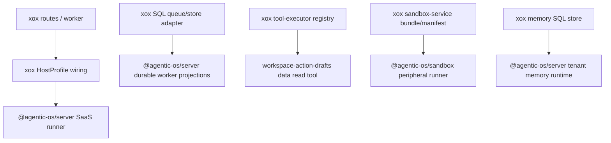

# M178 Five CPU Entry Deletion

## Goal

Delete the remaining xox-owned harness entrypoints called out after M177. xox-model must stay a downstream SaaS host: tools, prompts, business reads/writes, SQL storage, product DTOs and localized copy may remain; agent loop/runtime/recovery/sandbox/memory semantics must enter through Agentic OS package APIs.

## Required cuts

1. `apps/api/src/agent/host-profile/xox-host-profile.ts`
   - Keep: xox HostProfile facts, tool registry mapping, business action ports, provider settings, prompt asset loading, localized event copy.
   - Delete locally owned server/adapter/resume choreography. The file must call a SaaS-level Agentic OS runner API rather than manually building `createAgentServerSaaSHostAdapter()` + `createAgentServerSaaSRunPlane()` + `resumeAgentServerRun()` / `confirmAgentServerActionAndResume()`.

2. `apps/api/src/agent/agentic-os/xox-run-worker-adapter.ts`
   - Keep: SQL row claiming, tenant/workspace/user loading, lease refresh, DB writes, product thread/event notifications.
   - Delete local recovery/fail/cancel lifecycle projection entrypoints. Durable worker completion and interruption projection must come from `@agentic-os/server`; xox applies those projections to SQL rows.

3. `apps/api/src/agent/tool-executor.ts`
   - Keep: business tool handler registry and business write execution.
   - Delete `answerWorkspaceDataQuestion()` from the executor. Workspace data reads must be a normal xox business read tool implementation, not a local agent data-answer lane. The executor should only route `data.query_workspace` to that tool.

4. `apps/api/src/agent/sandbox-service.ts`
   - Keep: workspace data bundle, manifest, exposed business SDK list, uploaded-file policy, localized read DTO.
   - Delete direct sandbox CPU calls to low-level loop/projection helpers. xox should consume a SaaS-level sandbox peripheral API from `@agentic-os/sandbox`.

5. `apps/api/src/agent/memory.ts`
   - Keep: tenant-scoped SQL memory repository, Memory Center DTOs, archive/promote management.
   - Delete direct construction of the core memory capture runtime. Capture/rank/search/get semantics must be exposed through `@agentic-os/server`; xox only persists rows and maps DB fields.

## Module Division



## Dependency Graph

- `@agentic-os/server`
  - Adds SaaS runner helpers for profile execution and confirmation resume.
  - Adds durable run terminal/interruption projections.
  - Adds server-level tenant memory capture runtime wrapper.
- `@agentic-os/sandbox`
  - Adds a peripheral runner that owns loop + projection sequencing.
- `xox-model/apps/api/src/agent`
  - Consumes only package-level SaaS APIs.
  - Keeps domain handlers and SQL persistence.

## Reuse / Interface Plan

- Reuse existing `createAgentServerSaaSHostProfile()`, `createAgentServerSaaSRunPlane()`, `confirmAgentServerActionAndResume()`, `resumeAgentServerRun()`.
- Add one server-level runner wrapper instead of a xox runner facade.
- Reuse existing `runAgenticSandboxToolLoop()` and `projectAgenticSandboxObservationRead()` inside `@agentic-os/sandbox`; xox must not import them directly.
- Reuse existing `createAgentMemoryCaptureRuntime()` inside `@agentic-os/server`; xox must not import it directly.
- Reuse xox `workspace-action-drafts.ts` as the business read-tool home for workspace data query behavior.

## Naming / Style

- Agentic OS APIs use `AgentServer...` or `AgenticSandbox...` names.
- xox functions that remain must be named after concrete peripherals: `apply...Projection`, `plan...Read`, `build...Bundle`.
- Avoid `answer...Lane`, `run...Loop`, `runtime...` names in xox.

## Validation

Run:

```bash
npm run build -w @agentic-os/core
npm run build -w @agentic-os/server
npm run build -w @agentic-os/sandbox
npm run test -w @agentic-os/server
npm run test -w @agentic-os/sandbox
```

Then in `C:\Github\xox-model`:

```bash
npm run build:api
cd apps/api && npx vitest run tests/agent-architecture.test.ts tests/action-observation.test.ts tests/sandbox-tool.test.ts
```

## Architecture Guards

`apps/api/tests/agent-architecture.test.ts` must reject:

- direct xox production imports/calls of `createAgentServerSaaSHostAdapter`, `createAgentServerSaaSRunPlane`, `resumeAgentServerRun`, `confirmAgentServerActionAndResume`;
- `answerWorkspaceDataQuestion` in `tool-executor.ts`;
- direct `runAgenticSandboxToolLoop` and `projectAgenticSandboxObservationRead` in `sandbox-service.ts`;
- direct `createAgentMemoryCaptureRuntime` in `memory.ts`;
- xox-local `failInterruptedAgentRun` and direct failure/cancellation completion projection in the worker adapter.

## Alignment

This slice follows the product analogy: Agentic OS is the complete SaaS harness computer; xox provides storage, memory rows, business tools, workspace data bundles, display DTOs and transport. xox may observe and persist Agentic OS facts, but it must not own the harness CPU entrypoints.

## Implementation Result

- `@agentic-os/server`
  - Added `runAgentServerSaaSProfileRun()` and `confirmAgentServerSaaSProfileActionAndResume()` so downstream hosts submit a HostProfile instead of building run-plane/adapter/resume choreography locally.
  - Added `projectAgentServerInterruptedRunCompletion()` so durable interruption/failure/cancellation terminal projection is server-owned.
  - Added `createAgentServerTenantMemoryCaptureRuntime()` and `AgentServerTenantMemoryRecordLike` so downstream memory stores do not directly construct the core memory capture runtime.
- `@agentic-os/sandbox`
  - Added `runAgenticSandboxPeripheralRead()` so sandbox loop execution and read projection sequencing are package-owned.
- `xox-model`
  - `xox-host-profile.ts` now calls the SaaS profile runner helpers and no longer imports direct server adapter/run-plane/resume helpers.
  - `xox-run-worker-adapter.ts` now applies server interruption projections to SQL rows and no longer owns `failInterruptedAgentRun` or direct failure/cancellation completion projections.
  - `tool-executor.ts` no longer defines `answerWorkspaceDataQuestion()`; `data.query_workspace` routes to the business read implementation `planWorkspaceDataQueryRead()` in `workspace-action-drafts.ts`.
  - `sandbox-service.ts` now consumes `runAgenticSandboxPeripheralRead()` and no longer directly calls low-level sandbox loop/projection helpers.
  - `memory.ts` now consumes server memory capture runtime and no longer imports `createAgentMemoryCaptureRuntime()`.
  - `agent-architecture.test.ts` now guards these deleted entrypoints from returning.

## Validation Evidence

Passed:

```bash
npm run build -w @agentic-os/server
npm run build -w @agentic-os/sandbox
npm run test -w @agentic-os/server
npm run test -w @agentic-os/sandbox
```

Passed in `C:\Github\xox-model`:

```bash
npm run build:api
```

Passed in `C:\Github\xox-model\apps\api`:

```bash
npx vitest run tests/agent-architecture.test.ts tests/action-observation.test.ts tests/sandbox-tool.test.ts
```

Result: 3 files passed / 30 tests passed.
