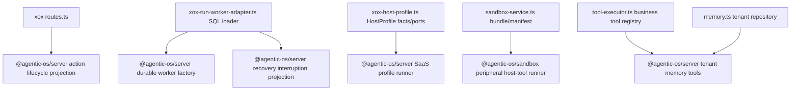

# M179 Five Host Peripheral Cuts

Status: Implemented

## Goal

Cut the next five host-owned harness surfaces from `apps/api/src/agent` without changing xox business behavior.

xox-model remains a downstream SaaS host. It may keep tools, product prompt assets, business reads/writes, SQL rows, provider settings, sandbox bundles, Memory Center DTOs, HTTP/SSE transport, and localized display copy. Agentic OS must own the reusable harness computer: run worker lifecycle, action lifecycle projection, memory tool semantics, sandbox nested tool loop sequencing, runtime/profile entrypoints, and generic event projection.

## Cut Plan

1. `host-profile/xox-host-profile.ts`
   - Keep: HostProfile facts, xox tool registry mapping, SQL/action/memory/sandbox ports.
   - Delete/downshift: local runtime event wrapper functions and low-level SaaS execution choreography.
   - Agentic OS API: consume SaaS profile run helpers and runtime/package projections directly.

2. `agentic-os/xox-run-worker-adapter.ts`
   - Keep: xox SQL row loading, tenant authorization facts, provider settings resolution.
   - Delete/downshift: direct worker factory/queue composition and recovery fail-closed wording/projection.
   - Agentic OS API: durable worker factory plus recovery fail-closed interruption projection.

3. `routes.ts` action cancel/update
   - Keep: HTTP auth/body parsing and xox SQL mutation.
   - Delete/downshift: direct construction of generic action lifecycle events/messages.
   - Agentic OS API: action cancellation/update projections returning standard event, signal, row-status effects, and assistant copy.

4. `sandbox-service.ts`
   - Keep: workspace bundle, file inspection, manifest policy, exposed business SDK allowlist, xox read DTO.
   - Delete/downshift: local `createAgentServerHostToolResultPort` sandbox tool loop wiring and aggregate nested-call semantics.
   - Agentic OS API: sandbox peripheral host-tool runner that owns host-tool result runtime connection for nested calls and aggregate planning.

5. `memory.ts` + `tool-executor.ts`
   - Keep: tenant memory repository, Memory Center state, xox memory routes.
   - Delete/downshift: local memory tool handler semantics, especially `memory.remember` parsing/copy.
   - Agentic OS API: tenant memory tool handler builder for search/get/remember.

## Dependency Graph



## Naming and Style

- New Agentic OS names use `AgentServer...` for server/run/action/memory APIs and `AgenticSandbox...` for sandbox APIs.
- xox code keeps `xox-*adapter` only when it owns durable SQL, product DTO, transport, or business policy.
- Do not add new root files under `apps/api/src/agent` with names like runner, runtime, loop, evaluator, gateway, or planner.

## Validation

Run:

```powershell
npm run build -w @agentic-os/core
npm run build -w @agentic-os/server
npm run build -w @agentic-os/sandbox
npm run test -w @agentic-os/server
npm run test -w @agentic-os/sandbox
```

Then in `C:/Github/xox-model`:

```powershell
npm run build:api
cd apps/api
npx vitest run tests/agent-architecture.test.ts tests/action-observation.test.ts tests/sandbox-tool.test.ts
```

Finally scan production agent code for deleted local harness entrypoints.

2026-06-26 result:

- `npm run build -w @agentic-os/core` passed.
- `npm run build -w @agentic-os/server` passed.
- `npm run build -w @agentic-os/sandbox` passed.
- `npm run test -w @agentic-os/server` passed: 55 tests.
- `npm run test -w @agentic-os/sandbox` passed: 8 tests.
- `npm run build:api` passed in `C:/Github/xox-model`.
- `npx vitest run tests/agent-architecture.test.ts tests/action-observation.test.ts tests/sandbox-tool.test.ts` passed: 30 tests.
- Residual scan found no production references to the deleted local harness entrypoints:
  `createAgentServerMemoryToolHandlers`, `rememberFromToolCall`, `createAgentServerRunWorker`, `createDurableRunQueuePort`, `agentServerRunRecoveryFailClosedMessage`, `appendOpenAIAgentsRuntimeEvent`, direct `actionCancelled` / `actionUpdated` event construction, `answerWorkspaceDataQuestion`, or `executeXoxDirectAnswerLane`.

## Implementation Notes

- `routes.ts` now uses `projectAgentServerActionCancellation()` and `projectAgentServerActionUpdate()` for generic action lifecycle status, event, assistant message, and thread signal projection. xox only performs auth, SQL row mutation, and response DTO serialization.
- `xox-run-worker-adapter.ts` now uses `createAgentServerDurableRunWorker()` and `projectAgentServerRunRecoveryFailClosedInterruption()`. xox keeps the durable SQL store/executor and no longer composes the worker from lower-level queue primitives or formats fail-closed recovery messages locally.
- `tool-executor.ts` now uses `createAgentServerTenantMemoryToolHandlers()` for `memory.search`, `memory.get`, and `memory.remember`. xox only supplies the tenant memory repository and localized copy.
- `sandbox-service.ts` uses `createAgenticSandboxHostToolPeripheral()` for nested host-tool execution and aggregate action planning. xox keeps workspace bundle, manifest policy, SDK allowlist, and product confirmation card DTOs.
- `xox-host-profile.ts` no longer reinterprets OpenAI Agents runtime events through a local `appendOpenAIAgentsRuntimeEvent()` wrapper; it persists the runtime/package draft directly.

## Guardrails Added

- Agentic OS server tests cover action lifecycle projections, fail-closed recovery interruption projection, durable worker factory, and tenant memory remember tool semantics.
- Agentic OS sandbox tests cover the reusable host-tool peripheral wiring.
- xox architecture tests now reject the deleted local memory remember helper, direct action cancel/update event construction, low-level durable queue/worker composition, and local OpenAI Agents runtime event translation.
