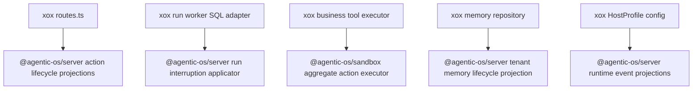

# M180 One Cut Host Harness Residue

Status: Implemented

## Goal

Remove the next visible host-owned harness residues from `apps/api/src/agent` in one pass.

xox remains the first downstream SaaS host. It may keep tool catalogs, product prompts, business tool execution, SQL stores, provider settings, sandbox bundles, Memory Center DTOs, HTTP/SSE transport, and localized copy. It must not decide reusable Agentic OS lifecycle semantics such as action failure projection, run interruption effects, sandbox aggregate action loops, memory lifecycle status transitions, or runtime recovery event projection.

## Module Plan

1. `@agentic-os/server`
   - Add action execution failure projection beside cancel/update.
   - Add runtime planning recovery event projection so hosts persist drafts instead of constructing lifecycle events.
   - Add run interruption projection applicator so hosts pass durable-store effects rather than sequencing generic status/event updates.
   - Add tenant memory lifecycle projection for promote/archive decisions.

2. `@agentic-os/sandbox`
   - Add aggregate action executor for confirmed sandbox aggregate actions.
   - Hosts provide the aggregate row, payload, nested-action materializer, business executor, and audit sink.

3. `xox-model/apps/api/src/agent`
   - `routes.ts`: stop importing/using `agentServerRunLifecycleEvents` for action execution failure.
   - `xox-run-worker-adapter.ts`: delete local generic interruption sequencing and call the Agentic OS applicator.
   - `tool-executor.ts`: delete local `sandbox.aggregate_tool_calls` loop and call the Agentic OS sandbox aggregate executor.
   - `memory.ts`: delete local promote/archive lifecycle policy and call Agentic OS memory lifecycle projections.
   - `xox-host-profile.ts`: remove local runtime recovery/stream helper functions and consume Agentic OS server projections.

## Dependency Graph



## Validation

Run:

```powershell
npm run build -w @agentic-os/server
npm run build -w @agentic-os/sandbox
npm run test -w @agentic-os/server
npm run test -w @agentic-os/sandbox
```

Then in `C:/Github/xox-model`:

```powershell
npm run build:api
cd apps/api
npx vitest run tests/agent-architecture.test.ts tests/action-observation.test.ts tests/sandbox-tool.test.ts
```

## Completion Check

The cut is not complete unless production xox agent code no longer directly references:

- `agentServerRunLifecycleEvents.actionExecutionFailed`
- local `applyRunInterruptionProjection`
- local `sandbox.aggregate_tool_calls` execution loop
- local memory promotion/archive decision predicates
- local runtime planning recovery event construction

## 2026-06-26 Result

Implemented in one pass:

- `@agentic-os/server` now exposes `projectAgentServerActionExecutionFailure()`, `projectAgentServerRuntimePlanningRecoveryRunEvent()`, `projectAgentServerModelPlanningRunEvent()`, `applyAgentServerRunInterruptionProjection()`, `projectAgentServerTenantMemoryPromotion()`, and `projectAgentServerTenantMemoryArchive()`.
- `@agentic-os/sandbox` now exposes `executeAgenticSandboxAggregateAction()` for confirmed aggregate sandbox action execution.
- `routes.ts` no longer imports `agentServerRunLifecycleEvents` or constructs action execution failure events locally.
- `xox-run-worker-adapter.ts` no longer owns the generic run interruption effect order; it supplies SQL/message/event/signal effects to `applyAgentServerRunInterruptionProjection()`.
- `tool-executor.ts` and `tool-policy.ts` no longer own the nested sandbox aggregate action loop; both call `executeAgenticSandboxAggregateAction()`.
- `memory.ts` no longer owns promote/archive lifecycle decisions; it consumes Agentic OS tenant memory lifecycle projections.
- `xox-host-profile.ts` no longer owns `hostToolResults`, `runtimeUserContent()`, local stream source wrapping, or direct runtime recovery/model-planning event construction. Business tool step materialization now sits at the concrete `tool-executor.ts` boundary.

Validation passed:

- `npm run build -w @agentic-os/server`
- `npm run build -w @agentic-os/sandbox`
- `npm run test -w @agentic-os/server`: 59 passed
- `npm run test -w @agentic-os/sandbox`: 9 passed
- `npm run build:api`
- `npx vitest run tests/agent-architecture.test.ts tests/action-observation.test.ts tests/sandbox-tool.test.ts`: 30 passed

Residual boundary:

- `xox-host-profile.ts` still builds the concrete HostProfile runtime/action/sandbox/active-memory ports because Agentic OS does not yet expose a higher-level SaaS HostProfile factory that can consume xox provider settings, action executor, sandbox peripheral, memory repository, and product copy declaratively. This is the next CPU cut; it should be solved by a real Agentic OS API, not by moving the same runner logic to another xox file.
