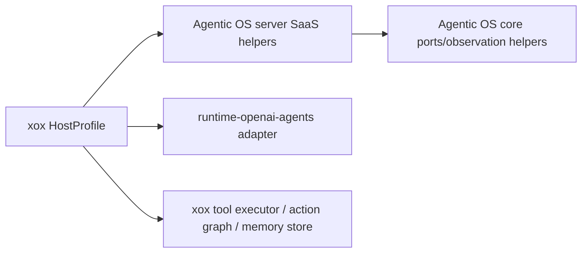

# M181 HostProfile Port Amputation

## Goal

Cut the remaining visible harness port assembly out of `apps/api/src/agent/host-profile/xox-host-profile.ts`.

`xox-model` must not hand-build the CPU-facing `AgentActionPort`, `AgentSandboxPort`, tool read executor, runtime stream/recovery event projection, or action execution result envelope inside HostProfile. It should provide only:

- provider settings and prompt text
- tool catalog entries and tool-call-to-business-step mapping
- business tool/action execution
- durable SQL stores and product DTO projection
- memory/sandbox peripheral data access
- localized copy

## Module Plan

### `C:\Github\agentic-os\packages\server\src\index.ts`

Add server-level SaaS helpers:

- `createAgentServerSaaSHostExecutionPorts()`
  - owns tool read executor wiring
  - owns action preview/edit/reject port construction
  - owns sandbox execution observation projection
  - consumes host callbacks for step storage, action row mapping, and confirmed business execution
- `createAgentServerSaaSRuntimeEventHandlers()`
  - owns runtime stream event projection
  - owns OpenAI-compatible planning recovery projection
  - owns model-planning lifecycle event projection

Dependency graph:



### `C:\Github\xox-model\apps\api\src\agent\host-profile\xox-host-profile.ts`

Delete visible CPU wiring:

- remove `xoxRuntimePort()`
- remove `const actions: AgentActionPort`
- remove `const sandbox: AgentSandboxPort`
- remove local runtime planning recovery projection
- replace with declarative `createAgentServerSaaSHostExecutionPorts()` and `createAgentServerSaaSRuntimeEventHandlers()` calls

### `C:\Github\xox-model\apps\api\src\agent\tool-executor.ts`

Keep business execution at the real peripheral boundary:

- export xox action row -> Agentic OS action request mapping
- export confirmed business action execution result envelope
- keep actual domain writes and audit rows here

This is not a new harness layer; it is the business tool/action peripheral.

## Naming Consistency

- Agentic OS APIs use `AgentServerSaaS*` names because they are SaaS harness/server APIs, not xox-specific shims.
- xox exports use `xox*BusinessAction*` / `xoxOsAction*` names because they are product row/DTO adapters.

## Validation

Expected passing commands:

```powershell
cd C:\Github\agentic-os
npm run build -w @agentic-os/server
npm run test -w @agentic-os/server

cd C:\Github\xox-model
npm run build:api
cd apps/api
npx vitest run tests/agent-architecture.test.ts tests/action-observation.test.ts tests/sandbox-tool.test.ts
```

## Acceptance

- `xox-host-profile.ts` does not contain `function xoxRuntimePort`, `const actions: AgentActionPort`, `const sandbox: AgentSandboxPort`, direct runtime recovery projection wiring, or direct sandbox observation parsing.
- xox still preserves API behavior and legacy DTO projection.
- Agentic OS owns the reusable port lifecycle.

## Implemented

- Added `@agentic-os/server` `createAgentServerSaaSHostExecutionPorts()`.
  - It builds tool read execution, action preview/edit/reject/execute port surfaces, and sandbox execution projection from host peripheral callbacks.
  - It owns generic sandbox observation parsing and action request projection sequencing.
- Added `@agentic-os/server` `createAgentServerSaaSRuntimeEventHandlers()`.
  - It projects provider stream events, OpenAI-compatible planning recovery events, and model-planning lifecycle events.
- Updated `xox-host-profile.ts`.
  - Deleted `xoxRuntimePort()`.
  - Deleted visible `AgentActionPort` and `AgentSandboxPort` construction.
  - Deleted local runtime recovery/model-planning projection wiring.
  - Deleted local sandbox observation parsing.
  - Collapsed active-memory wiring into a memory peripheral profile fragment.
- Updated `tool-executor.ts`.
  - It now owns confirmed xox business action execution and xox action row -> Agentic OS action request mapping at the business peripheral boundary.
- Updated architecture tests to guard the deleted HostProfile CPU wiring from returning.

## Validation Evidence

Passed:

```powershell
cd C:\Github\agentic-os
npm run build -w @agentic-os/server
npm run build -w @agentic-os/runtime-openai-agents
npm run test -w @agentic-os/server

cd C:\Github\xox-model
npm run build:api
cd apps/api
npx vitest run tests/agent-architecture.test.ts tests/action-observation.test.ts tests/sandbox-tool.test.ts
```

The focused xox test run passed 30 tests across 3 files.

## Remaining Boundary

`xox-host-profile.ts` still resolves provider settings, prompt text, base context facts, store port, and concrete runtime adapter selection. That is acceptable for this cut because the reusable runtime execution and event projection are now Agentic OS-owned. The next deletion target is to reduce HostProfile further into declarative provider/tool/context/memory/sandbox fragments once Agentic OS exposes a single SaaS profile factory for provider settings and context assembly.
