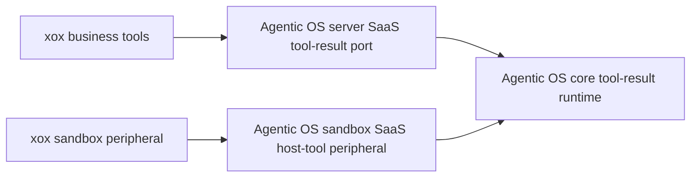

# M182 Tool Result Runtime Amputation

## Goal

Delete duplicated tool-result runtime configuration from `apps/api/src/agent`. xox must not define generic clarification, account-boundary, navigation-read status, or empty-tool-result semantics inside `tool-executor.ts` or `sandbox-service.ts`.

## Module Boundary

- `@agentic-os/core`
  - Owns default SaaS tool-result runtime copy and status behavior.
  - Exposes locale-aware defaults for generic observation types.
- `@agentic-os/server`
  - Exposes a SaaS-level host tool-result port wrapper.
- `@agentic-os/sandbox`
  - Exposes a SaaS-level sandbox host-tool peripheral wrapper.
- `xox-model`
  - Keeps only business tool handlers, sandbox bundle/policy, and the xox navigation route encoder.

## Dependency Graph

## Validation

- `npm run build -w @agentic-os/core`
- `npm run build -w @agentic-os/server`
- `npm run build -w @agentic-os/sandbox`
- `npm run build:api`
- Relevant architecture and sandbox/tool tests in `apps/api`.

## Result

Implemented.

- Deleted duplicated `copy`, `readStatus`, and low-level `resultRuntime` configuration from `tool-executor.ts` and `sandbox-service.ts`.
- Added Agentic OS SaaS-level defaults and wrappers:
  - `createAgentServerSaaSHostToolResultPort()`
  - `createAgenticSandboxSaaSHostToolPeripheral()`
  - `locale: 'zh-CN'` defaults in the core host tool-result runtime.
- Left xox with only `xoxNavigationFromTabs()` as the host route encoder for this slice.

Validation passed:

- `npm run build -w @agentic-os/core`
- `npm run build -w @agentic-os/server`
- `npm run build -w @agentic-os/sandbox`
- `npm run test -w @agentic-os/core`
- `npm run test -w @agentic-os/server`
- `npm run test -w @agentic-os/sandbox`
- `npm run build:api`
- `npx vitest run tests/agent-architecture.test.ts tests/action-observation.test.ts tests/sandbox-tool.test.ts`
- `npx vitest run tests/api.test.ts -t "asks for clarification through a model-selected tool"`
