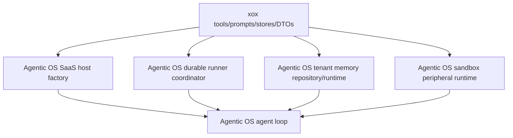

# M184 Host CPU Amputation

## Goal

xox must not assemble or own Agentic OS harness mechanics. xox is a downstream SaaS host that provides tools, prompts, business stores, business write executors, workspace bundles, and product DTOs. Agentic OS owns runtime assembly, worker lifecycle, memory kernel, sandbox peripheral execution, tool-result planning, and action-loop continuation.

## Deletion Boundary

### xox-host-profile.ts

Delete direct runtime and execution-port assembly from xox:

- no `createOpenAISaaSRuntimeAdapter`
- no `createAgentServerSaaSRuntimeEventHandlers`
- no `createAgentServerSaaSHostExecutionPorts`
- no active-memory profile construction

xox may only pass host settings, prompt text, tool registry, context facts, business step storage, and business action execution callbacks into an Agentic OS high-level factory.

### xox-run-worker-adapter.ts

Delete visible worker lifecycle ownership from xox:

- no `createAgentServerDurableRunWorker`
- no exported `completeAgentRun`
- no exported `recoverRunningAgentRuns`
- no exported `scheduleAgentRunQueueDrain`
- no local worker singleton helper named `getAgentRunWorker`

xox may provide durable row loading, SQL lease operations, and effect adapters. Agentic OS owns run queue coordination and lifecycle methods.

### memory.ts

Delete memory-kernel construction from xox:

- no direct capture runtime assembly
- no direct ranking/projector imports in host-visible memory functions
- no `createXoxActiveMemoryProfileInput`

xox may keep repository CRUD and Memory Center DTOs. Agentic OS owns active memory recall/search/get/capture semantics.

### sandbox-service.ts

Delete sandbox peripheral execution loop ownership from xox:

- no local `runSandboxPeripheralCode`
- no direct `runAgenticSandboxPeripheralRead`
- no direct SaaS host tool peripheral construction

xox may build bundle, manifest, tool SDK, and xox observation DTO. Agentic OS owns peripheral execution, nested tool bridge, aggregate action creation, and read projection.

### tool-executor.ts

Delete visible planner/memory runtime wiring from xox:

- no `createAgentServerSaaSBusinessToolPlanner`
- no `createAgentServerSaaSTenantMemoryToolHandlers`

xox may export business tool handlers and confirmed business write execution only.

## Dependency Direction

## Validation

- `npm run build -w @agentic-os/server`
- `npm run build -w @agentic-os/sandbox`
- `npm run build -w @agentic-os/runtime-openai-agents`
- `npm run test -w @agentic-os/server`
- `npm run test -w @agentic-os/sandbox`
- `npm run build:api`
- `cd apps/api && npx vitest run tests/agent-architecture.test.ts tests/action-observation.test.ts tests/sandbox-tool.test.ts`

## Guardrail

`apps/api/tests/agent-architecture.test.ts` must fail if the deleted CPU-level symbols return to `apps/api/src/agent`.
