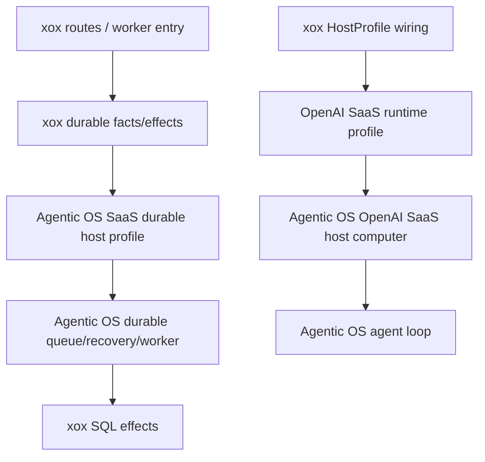

# M187: Durable Host Profile Boundary

Status: Implemented

Date: 2026-06-26

## Goal

Finish the remaining visible CPU residue in `apps/api/src/agent` after M186. The target shape is:

- Agentic OS owns durable run lifecycle composition, queue/recovery/fail-closed decisions, provider runtime profile assembly, and HostProfile-to-runtime computer creation.
- xox-model owns durable SQL facts/effects, provider settings values, tool catalog, prompt assets, business action execution, product DTOs, routes, and event persistence.

This is not a whole-file deletion step. It is a boundary compression step: remove xox-visible lifecycle method names and low-level runtime assembly from the first downstream host.

## Current Problem

`apps/api/src/agent/agentic-os/xox-run-store-adapter.ts` no longer imports old low-level worker helpers, but it still constructs an `AgentServerDurableRunQueueStore` directly. That leaves lifecycle method names in the downstream app:

- `claimPendingRuns`
- `claimRecoverableRuns`
- `markRunStarted`
- `markRunCompleted`
- `markRunFailed`
- `failClosedRecovery`

`apps/api/src/agent/host-profile/xox-host-profile.ts` now uses `createOpenAISaaSHostComputer()`, but it still passes low-level runtime groups named `compatible`, `agents`, and `selectAdapter`. This is better than M185, but it still makes xox look like it understands the CPU's runtime assembly.

M187 resolves this by moving both shapes behind Agentic OS profile-level facades. The problem statement is retained as the pre-change design rationale.

## Module Division

Agentic OS:

- `packages/server/src/index.ts`
  - Add a SaaS durable host profile/factory that accepts host facts/effects and creates the durable run host internally.
  - Keep queue/recovery classification, fail-closed projection, completion projection, and worker/coordinator wiring inside Agentic OS.
- `packages/runtime-openai-agents/src/index.ts`
  - Add a higher-level OpenAI SaaS runtime profile input that names host intent instead of exposing low-level adapter groups.

xox-model:

- `apps/api/src/agent/agentic-os/xox-run-store-adapter.ts`
  - Replace direct durable queue store construction with a declarative durable run profile.
  - Keep only SQL row loading, lease claiming, xox queued-run mapping, failure persistence effects, and result materialization.
- `apps/api/src/agent/host-profile/xox-host-profile.ts`
  - Replace low-level runtime object wiring with one provider runtime profile builder call.
  - Keep prompt, provider settings values, context facts, tool registry, business executor, and product event persistence.
- `apps/api/tests/agent-architecture.test.ts`
  - Guard against visible durable queue store method names and low-level runtime adapter groups returning to downstream source.

## Dependency Graph



The dependency direction remains one-way: xox depends on Agentic OS packages. Agentic OS never imports xox.

## Reuse / Interface Plan

- Reuse existing Agentic OS primitives:
  - `createAgentServerSaaSDurableRunHostFromParts`
  - `projectAgentServerSaaSQueuedRunCompletion`
  - `projectAgentServerSaaSRunRecoveryFailClosed`
  - `hasAgentServerSaaSRunDurableOutput`
  - `createOpenAISaaSHostComputer`
- Add one higher-level durable profile interface in `@agentic-os/server` so downstream hosts pass:
  - `claimRows(source)`
  - `loadRun(row)`
  - `toQueuedRun(load)`
  - `partialOutput(run)`
  - `executeQueuedRun(input)`
  - `effects`
- Add one higher-level OpenAI runtime profile builder in `@agentic-os/runtime-openai-agents` so downstream hosts pass:
  - provider/model/key/base URL getters
  - system prompt
  - observation replay adapter
  - runtime event sink
  - adapter selection policy

## Naming / Style

- Use `SaaS...Profile` for declarative input objects.
- Use `create...FromProfile` for Agentic OS factories that hide lifecycle wiring.
- Keep xox function names prefixed with `xox` only when they are SQL/domain/peripheral callbacks.
- Avoid downstream names such as `QueueStore`, `RunWorker`, `RuntimeAdapter`, `Recovery`, or `Port` unless they are imported types from Agentic OS.

## Validation

Agentic OS:

```bash
npm run build -w @agentic-os/server
npm run build -w @agentic-os/runtime-openai-agents
npm run test -w @agentic-os/server
npm run test -w @agentic-os/runtime-openai-agents
```

xox-model:

```bash
npm run build:api
cd apps/api && npx vitest run tests/agent-architecture.test.ts tests/action-observation.test.ts tests/sandbox-tool.test.ts
```

Architecture guard expectations:

- `xox-run-store-adapter.ts` must no longer contain `AgentServerDurableRunQueueStore`.
- `xox-run-store-adapter.ts` must no longer contain direct object keys `claimPendingRuns`, `claimRecoverableRuns`, `markRunStarted`, `markRunCompleted`, `markRunFailed`, `failClosedRecovery`.
- `xox-host-profile.ts` must no longer expose `compatible:`, `agents:`, or `selectAdapter:` runtime groups.

## Alignment

This matches the “Agentic OS is the full computer; xox is hard disk, memory, display, and peripheral drivers” standard. The remaining xox code should describe durable facts and product effects, not how the CPU schedules, recovers, or assembles runtime adapters.
