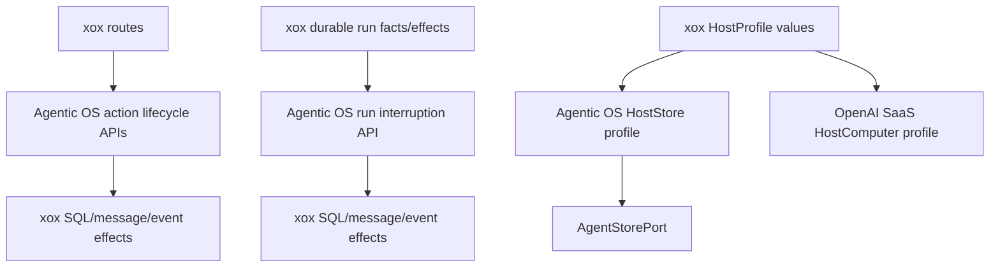

# M188: Action, Run Interruption, and Store Profile Boundary

Status: Implemented

Date: 2026-06-28

## Goal

Remove the last visible lifecycle assembly from `apps/api/src/agent` without deleting valid host peripherals.

M187 hid durable queue-store and OpenAI runtime adapter groups. M188 continues that direction:

- xox routes should not call action lifecycle projection helpers directly.
- xox durable run store should not call run interruption projection/apply helpers directly.
- xox HostProfile should not hand-build `AgentStorePort`.

The target remains: Agentic OS is the full SaaS harness computer; xox is durable storage, tools, prompts, provider setting values, business execution, product DTOs, and transport.

## Current Problem

### Run interruption

`agentic-os/xox-run-store-adapter.ts` still imports and calls:

- `projectAgentServerInterruptedRunCompletion()`
- `applyAgentServerRunInterruptionProjection()`

The code is not a local loop, but it still makes the first downstream host visibly sequence interruption projection/effects.

### Action lifecycle

`routes.ts` still imports and calls:

- `projectAgentServerActionExecutionFailure()`
- `projectAgentServerActionCancellation()`
- `projectAgentServerActionUpdate()`

The route owns HTTP/auth/DTOs, but action lifecycle projection should be one Agentic OS API that applies host effects.

### Host store port

`host-profile/xox-host-profile.ts` still imports `AgentStorePort` and hand-builds:

- `createRun`
- `claimRunLane`
- `refreshRunLease`
- `releaseRunLane`
- `appendEvent`
- `finishRun`

This is store wiring, not a loop, but it is still CPU-shaped and should move behind a HostComputer profile helper.

## Module Division

Agentic OS server:

- Add `applyAgentServerSaaSRunInterruption()` to own projection + effect sequencing for failed/cancelled/recovery-fail-closed run interruptions.
- Add action lifecycle effect helpers:
  - `applyAgentServerSaaSActionExecutionFailure()`
  - `applyAgentServerSaaSActionCancellation()`
  - `applyAgentServerSaaSActionUpdate()`
- Add `createAgentServerSaaSHostStorePort()` so downstream hosts pass store facts/effects instead of constructing `AgentStorePort`.
- Extend durable run profile so failure/invalid/recovery-fail-closed can use Agentic OS-owned interruption effects.

Agentic OS OpenAI runtime:

- Extend `createOpenAISaaSHostComputerFromProfile()` to accept `storeProfile` and build the store via Agentic OS server.

xox-model:

- `xox-run-store-adapter.ts` keeps SQL row loading, lease claiming, durable run effects, and result materialization; it stops importing direct interruption projection/apply helpers.
- `routes.ts` keeps HTTP/auth/body parsing/response DTO; it stops importing direct action projection helpers.
- `xox-host-profile.ts` keeps provider setting values, prompt, context facts, tool registry, business executor, and product event persistence; it stops importing `AgentStorePort`.

## Dependency Graph



## Validation

Agentic OS:

```bash
npm run build -w @agentic-os/server
npm run build -w @agentic-os/runtime-openai-agents
npm run test -w @agentic-os/server
npm run test -w @agentic-os/runtime-openai-agents
```

xox-model:

```bash
npm run build:api
cd apps/api && npx vitest run tests/agent-architecture.test.ts tests/action-observation.test.ts tests/sandbox-tool.test.ts
```

Architecture guard expectations:

- `apps/api/src/agent` must not contain `projectAgentServerActionExecutionFailure`, `projectAgentServerActionCancellation`, or `projectAgentServerActionUpdate`.
- `apps/api/src/agent` must not contain `applyAgentServerRunInterruptionProjection` or `projectAgentServerInterruptedRunCompletion`.
- `host-profile/xox-host-profile.ts` must not contain `AgentStorePort`, `claimRunLane`, `refreshRunLease`, or `releaseRunLane`.

## Alignment

This keeps xox at the peripheral boundary. xox still persists rows, writes events, and returns product DTOs, but Agentic OS owns the lifecycle projection and store-port assembly.

## Implementation Result

Implemented Agentic OS APIs:

- `applyAgentServerSaaSActionCancellation()`
- `applyAgentServerSaaSActionUpdate()`
- `applyAgentServerSaaSActionExecutionFailure()`
- `applyAgentServerSaaSRunInterruption()`
- durable run profile `interruption`
- `createAgentServerSaaSHostStorePort()`
- `createOpenAISaaSHostComputerFromProfile({ storeProfile, runtimeProfile, ... })`

Updated xox boundaries:

- `routes.ts` now calls the Agentic OS SaaS action lifecycle APIs and only supplies SQL/message/event effects.
- `xox-run-store-adapter.ts` now calls the Agentic OS SaaS run interruption API and durable profile `interruption`; it no longer constructs or applies interruption projections.
- `xox-host-profile.ts` now passes a `storeProfile`; it no longer imports `AgentStorePort` or declares lane claim/release/refresh methods directly.

Guarded forbidden symbols:

- `projectAgentServerActionExecutionFailure`
- `projectAgentServerActionCancellation`
- `projectAgentServerActionUpdate`
- `applyAgentServerRunInterruptionProjection`
- `projectAgentServerInterruptedRunCompletion`
- `AgentStorePort`
- `claimRunLane`
- `refreshRunLease`
- `releaseRunLane`
