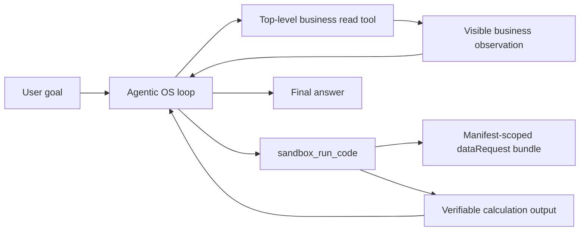

# M189: Sandbox 是计算外设，不是业务工具网关

## 背景

对话 `058232e9` 暴露出一个边界问题：模型把 `sandbox_run_code` 当成万能入口，在沙箱代码里通过 sandbox SDK 读取业务数据。这样虽然能完成任务，但用户可见轨迹只看到一次 `sandbox_run_code`，看不到模型先选择了哪个业务工具、读取了哪些业务事实。

这不符合当前 Agentic OS / xox 边界：

- Agentic OS 是 SaaS harness 整机，负责 agent loop、工具调用、观察、审计和投影。
- xox 是业务外设，提供工具、prompt、数据硬盘、显示器 DTO。
- 用户可见轨迹应该展示模型选择的语义动作：业务读、业务写确认、沙箱计算、最终回答。
- sandbox 只能做可复核计算、转换、文件处理和受控 artifact 生成；不能在模型选择层面伪装成所有业务工具的统一网关。

## 根因

当前偏置来自模型可见的 xox 工具说明，而不是 Agentic OS tool surface 排序：

- 当时的 `xox-planning-policy.md` 明确要求在 `sandbox_run_code` 代码里调用同名业务 SDK，并给出业务读取示例。
- `sandbox_run_code` 的 tool schema 把“通过同名工具 SDK 请求受控业务工具”放进主描述。
- `code` 参数说明继续用具体业务工具示例强化了这条路径。
- API 测试样例也把复杂计算写成 `sandbox_run_code` 内部 nested read，容易把坏模式固化成预期。

Agentic OS 只负责根据 capability、required tool、检索和 prerequisite 物化工具；它没有强制模型选择 sandbox。因此正确修复点是收窄 xox 暴露给模型的 sandbox 语义，同时保留 sandbox runtime 的能力作为低层受控桥。

## 设计

### 模块划分

- `apps/api/src/agent/host-profile/prompts/xox-planning-policy.md`
  - 声明通用策略：需要业务事实时先调用合适的顶层业务工具；sandbox 只对已有 observation、用户输入或受控 `dataRequest` bundle 做计算。
  - 不写死单个问题或单个工具名作为前置，只表达“业务事实 observation 优先于计算 observation”。

- `apps/api/src/agent/tool-catalog.ts`
  - 收窄 `sandbox_run_code` 的 provider-visible description。
  - 移除模型可见的 sandbox SDK 业务读取示例。
  - 明确 nested SDK 只是高级逃生口/运行时桥，不是顶层业务读写的替代。

- `apps/api/src/agent/sandbox-service.ts`
  - 保留 runtime SDK bridge，因为它是受控沙箱执行能力。
  - 调整 staged manifest 文案，避免在沙箱内文档继续把 SDK 描述为首选业务接口。

- `apps/api/tests/*`
  - 把复杂计算样例改成“顶层 `data_query_workspace` observation + sandbox 使用 `load_structured()` / `dataRequest` 计算”。
  - 添加架构守卫：provider-visible sandbox schema 不能再包含 sandbox SDK 业务读取示例，也不能把 sandbox 描述成首选业务工具网关。

### 依赖图

`agentic_os_sandbox.<tool_name>` runtime bridge 仍存在，但不是模型首选规划路径。它只服务沙箱内部受控执行、写入聚合确认和少量高级场景；正常业务事实必须先成为顶层 observation。

### 复用与抽象

- 不新增新的 host runner。
- 不新增关键词判断或问题特判。
- 复用现有 Agentic OS tool surface、sandbox manifest、tool runtime bridge 和 transcript projection。
- 修复通过 tool schema / planning policy 改变模型可见契约，而不是在服务端用正则拦截 `sandbox_run_code`。

### 命名与风格

- 继续使用 `sandbox_run_code` 表示计算外设。
- 继续使用 `dataRequest` 表示沙箱受控数据挂载。
- 文案统一使用“顶层业务工具 observation”和“sandbox calculation observation”区分语义。

## 验证

- `npm run test --workspace @xox/api -- tests/agent-architecture.test.ts tests/sandbox-tool.test.ts`
- `npm run test --workspace @xox/api -- tests/api.test.ts -t "continues from domain observations|replays repairable sandbox"`
- `npm run test --workspace @xox/api -- tests/api.test.ts -t "requires model-visible ordered shareholder|repairs shareholder fact obligations|keeps shareholder fact obligations"`
- `npm run build:api`
- 必要时启动 xox，重新跑 `058232e9` 类问题，预期轨迹是：
  - 先显示业务读取工具调用及返回；
  - 再显示 `sandbox_run_code` 的计算输入/输出；
  - 不显示 provider stream、worker、memory recall、final review 等内部技术状态。

## 本次验证结果

- 通过：`npm run test --workspace @xox/api -- tests/agent-architecture.test.ts tests/sandbox-tool.test.ts`
- 通过：`npm run test --workspace @xox/api -- tests/api.test.ts -t "continues from domain observations|replays repairable sandbox"`
- 通过：`npm run test --workspace @xox/api -- tests/api.test.ts -t "requires model-visible ordered shareholder|repairs shareholder fact obligations|keeps shareholder fact obligations"`
- 通过：`npm run build:api`
- 已跑完整 `npm run test --workspace @xox/api -- tests/api.test.ts`：74/90 通过。剩余 16 个失败集中在既有 run event/evaluation/provider/fail-closed/operating-model 断言漂移，其中 sandbox 相关的本次修复路径已单独通过。

## 风险

- 模型仍可能在少数复杂任务里主动使用 nested SDK。这个能力不会被移除，因为 sandbox bridge 本身是必要运行时能力；但 provider-visible 契约不再鼓励它作为首选入口。
- 如果未来要彻底禁止 nested read，需要 Agentic OS 增加 generic policy：按 tool metadata 标记 `visibleObservationRequired`，由 loop 在 sandbox 前自动要求顶层 observation。当前先做最小、通用、可验证的契约修正。
