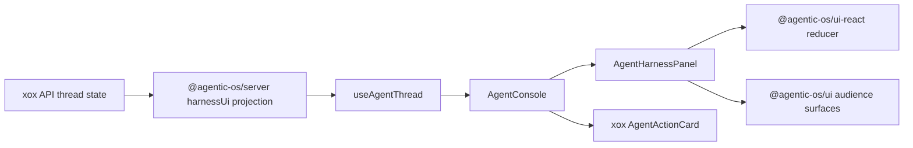

# M191 Agentic OS Harness Frontend Audience Surface

Status: Implemented

Date: 2026-07-03

## Goal

Integrate the Agentic OS ADR0058/ADR0059 frontend control plane into `xox-model` as the standard harness UI surface.

This is the frontend equivalent of the previous Agentic OS backend harness integration:

- Agentic OS owns the generic harness UI protocol, reducer, and audience surfaces.
- xox owns product route/auth permission, business artifacts, editable confirmation cards, provider settings, memory center, and domain navigation.
- xox must not fork the AG-UI reducer or build a second generic harness frontend.

## Module Division

| Module | Path | Responsibility | Must not own |
| --- | --- | --- | --- |
| Server projection | `apps/api/src/agent/agentic-os/xox-thread-store-adapter.ts` | Convert xox thread/run/message/action facts into Agentic OS `harnessUi` frames through `projectAgentServerHarnessUi()`. | React layout, AG-UI reducer logic, product editing UI. |
| Thread hook | `apps/web/src/hooks/useAgentThread.ts` | Store latest backend-owned `harnessUi` projection from REST/SSE/polling. | Harness event reduction, transcript synthesis from raw events. |
| Harness panel | `apps/web/src/components/agent/AgentHarnessPanel.tsx` | Reduce `harnessUi.frames` with `@agentic-os/ui-react` and render `@agentic-os/ui` audience surfaces. | Business action editing, protocol mutation, custom reducer. |
| Agent console | `apps/web/src/components/agent/AgentConsole.tsx` | Mount the harness panel as the xox run surface, pass confirm/cancel callbacks, and gate operator/developer modes. | Raw AG-UI parsing or generic harness panels. |
| Business timeline | `apps/web/src/components/agent/AgentChatTimeline.tsx` | Keep xox-specific editable confirmation cards and domain transcript projection until Agentic OS exposes a generic artifact renderer contract. | Generic harness protocol, operator/debug surfaces. |

## Dependency Graph



Forbidden edges:

- `apps/web` must not parse raw AG-UI events by hand.
- xox frontend must not define a second `user/operator/developer` harness surface taxonomy.
- xox frontend must not show operator/developer raw payloads unless the product shell explicitly grants inspection.
- xox editable business confirmation cards must not move into Agentic OS core as xox-specific logic.

## Interface Plan

`AgentHarnessPanel` is the downstream adapter for the standard Agentic OS frontend:

```ts
type Props = {
  threadId: string | null;
  harnessUi: AgentHarnessUiProjection | null;
  canInspectHarness?: boolean;
  onApprove?: (approvalId: string) => void;
  onReject?: (approvalId: string) => void;
};
```

Defaults:

- `audience="user"`;
- no operator/developer switcher unless `canInspectHarness=true`;
- `onApprove` maps to xox action confirmation;
- `onReject` maps to xox action cancellation;
- raw payload visibility follows the same inspection gate.

## Why Not Delete `AgentChatTimeline` Yet

Agentic OS ADR0059 gives the generic Codex-like run surface, but the current generic UI does not yet expose a host artifact renderer contract for xox's editable confirmation card fields.

xox therefore keeps `AgentChatTimeline` only as a product artifact/business-confirmation layer. The generic harness view, tool activity, trace, sandbox, final review, AG-UI reducer, and audience surfaces are sourced from Agentic OS.

When Agentic OS adds a typed host artifact renderer slot, xox should move editable confirmation card rendering behind that slot and retire any remaining duplicate timeline machinery.

## Validation

- `npm run build -w @agentic-os/ui-protocol`
- `npm run build -w @agentic-os/ui-react`
- `npm run build -w @agentic-os/ui`
- `npm run test:web`
- `npm run build:web`

