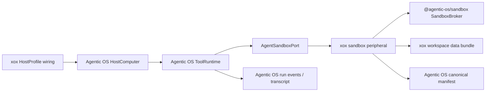

# M192 Agentic OS Sandbox Port Cutover

Status: Implemented

Date: 2026-07-05

## Requirement

After the `agentic-os` sandbox update, `xox-model` must keep the same user-facing behavior while consuming the new Agentic OS sandbox execution boundary. The host must not reintroduce a local harness loop: Agentic OS remains the complete computer, and xox remains storage, context, display, and peripheral wiring.

## Root Cause

`@agentic-os/core` now treats sandbox tools as first-class `AgentSandboxPort` executions. If the downstream host does not provide that port, `@agentic-os/server` deliberately returns a fail-closed result with `manifestScoped: false`, which blocks the run with `Sandbox result was not manifest-scoped`.

`xox-model` still had a working sandbox peripheral, but it was only connected through the legacy host read-draft path. Agentic OS no longer uses that path for sandbox execution, so conversation `8af7f108` failed before xox's manifest-scoped sandbox backend could run.

## Module Division

- `apps/api/src/agent/host-profile/xox-host-profile.ts`
  - Keeps HostProfile wiring only.
  - Passes `sandboxPort.executeSandbox` into `createOpenAISaaSHostComputerFromProfile()`.
  - Does not decide sandbox success, repair, retry, loop progress, or final answer readiness.

- `apps/api/src/agent/sandbox-service.ts`
  - Keeps xox-owned peripheral duties: workspace bundle construction, manifest creation, sandbox SDK manifest, file policy, backend selection, and DTO projection.
  - Adds `executeXoxSandboxForAgenticOs()` to convert xox sandbox execution facts into `AgentSandboxExecutionResult`.
  - Does not own the agent loop, sandbox outcome policy, or post-observation continuation.

- `packages/contracts/src/index.ts`
  - Aligns xox sandbox manifest DTOs with Agentic OS canonical data scopes and runtime fields.
  - Provider-facing `SandboxRunCodeInput.dataRequest.scope` can still accept legacy xox scopes; persisted manifest `inputBundle.kind` is canonicalized before execution.

- `apps/api/tests/*`
  - Tests that need real sandbox execution explicitly choose `local-script` with the Agentic OS development opt-in.
  - Legacy `planSteps` assertions no longer expect sandbox entries, because sandbox tool activity is now projected from Agentic OS run events/transcript rather than xox's old read-step store.

## Dependency Graph

## Boundary Decision

Sandbox execution is no longer a normal xox `ReadDraft` tool step when invoked by the Agentic OS loop. The model-selected tool call is still user-visible, but it is visible through Agentic OS run events and transcript projection:

- `tool_call_completed` / `tool_call_failed`
- sandbox runtime metadata
- model-readable observation content
- final assistant continuation from the Agentic OS loop

This prevents xox from restoring a second local harness path while keeping the UI evidence lane available.

## Validation

- `npm.cmd run build:api`
- `npm.cmd run test --workspace @xox/api -- tests/sandbox-tool.test.ts tests/agent-architecture.test.ts`
- `npm.cmd run test --workspace @xox/api -- tests/api.test.ts -t "continues from domain observations|replays repairable sandbox|keeps empty sandbox observations|streams OpenAI-compatible tool-call chunks|retries malformed streamed tool-call arguments|retries streamed tool-call timeouts"`

Expected outcome: all commands pass.

## Migration Notes

- Local development without Docker should run xox with `XOX_SANDBOX_BACKEND=local-script`. The xox sandbox service passes the Agentic OS unsafe-local opt-in only when that backend is explicitly selected.
- Production should prefer an isolated backend such as Docker or a remote sandbox backend; xox should not silently fall back to local script execution in production.
