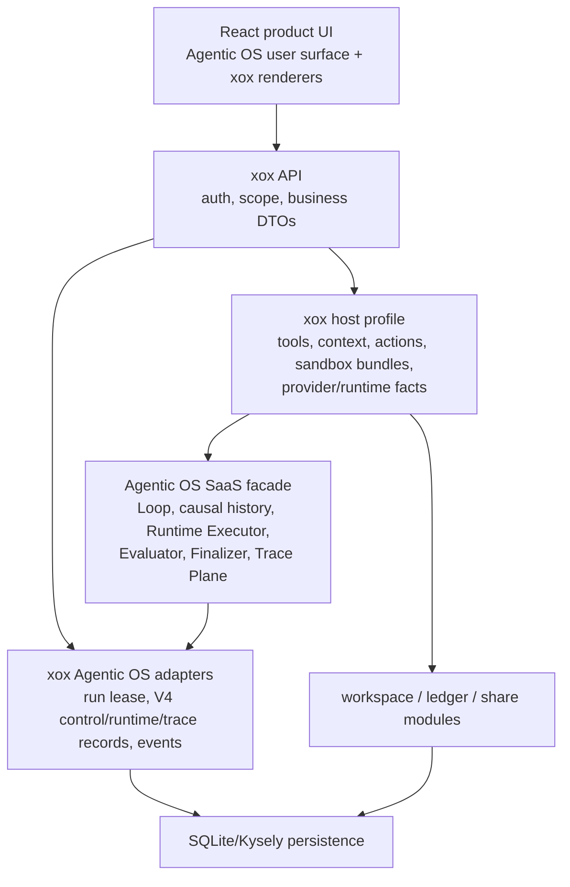

# xox-model Project Architecture

Status: Current after Agentic OS ADR 0075, ADR 0076, and ADR 0077

xox-model is a SaaS business host attached to Agentic OS. It supplies scoped
financial/workspace tools, action previews/execution, context, memory policy,
sandbox input bundles, provider settings, persistence, and localized product
projection. It does not own an agent loop, semantic Planner, Evaluator
replacement, or terminal authority.

## Runtime Source

`agent_runs.runtime_source` and API `runtimeSource` identify the provider leaf
used by a run: `openai_agents`, `openai_compatible_tool_calls`, or the explicit
local/CI `rules` path. This is diagnostic runtime metadata, not Planner
identity or execution authority. The old column is renamed in place; current
code has no dual reader or compatibility field.

## Harness Boundary

- Agentic OS owns `AgentLoopStateV4`, transition V2, model turns, tool-result
  causality, approval/wait/resume, compaction, Evaluator, and finalization.
- Agentic OS owns immutable Review admission and Lane start/deadline CAS; xox
  provides no timeout override, V1 reader, converter, or migration API. Old
  runs drain or terminate and their evaluator rows are purged before V2 starts.
- xox owns business tools, action execution, and localized result projection.
- Runtime selection is declarative and attempt-frozen. There is no `planning`
  Runtime purpose.
- business writes become server-owned action requests and obey Agentic OS
  automation/approval policy.
- sandbox receives only host-selected bundles and cannot access the API
  process, database, credentials, or another tenant.
- xox supplies one scoped durable backend; Agentic OS owns journal sequencing,
  span semantics, provider history projection, and acknowledgement.

## Persistence

- `agent_runs.runtime_source` stores bounded runtime identity.
- `agent_harness_control_records` stores scoped V4 loop state, transition V2,
  immutable history/runtime/child/progress/evaluator records, Runtime
  Execution Store records, and generation-fenced trace journal records.
- `agent_run_events` stores ordered canonical/product projection facts.
- `agent_plan_steps` remains a business-facing tool/action transcript table;
  it is not a semantic Planner DAG or continuation authority.

## UI

The user sees one interleaved conversation timeline with streamed assistant
output, tools, progress, approvals, child activity, review, and final answer.
Runtime source is a small diagnostic label. Operator/developer surfaces can
inspect bounded Agentic OS detail without exposing hidden reasoning or secrets.
